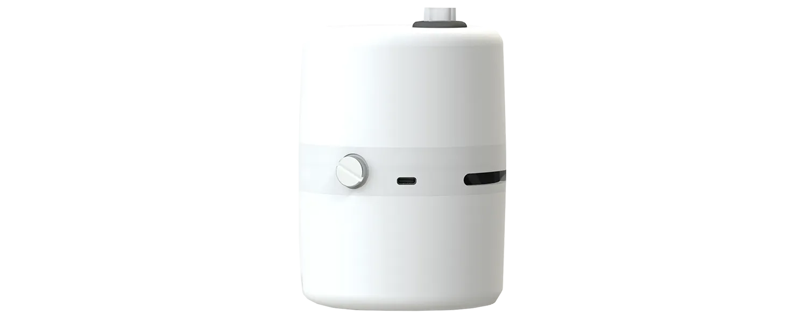

# SafyrOPC Datasheet

<figure><figcaption></figcaption></figure>

| 
<strong>TYPE OF ENVIRONMENT</strong>

Grade A, B, C and D

ISO 5, 7, 8

(Non-Grade A Submitted Pics PE009 - GMP Appendix 1)
 | 
Advanced Clean Room Real-Time Particle Monitoring

Energy savings, sleep mode, process security, incident detection

Designed exclusively for clean room use and controlled environment, the connected particle counter SafyrOPC is dedicated to the monitoring of Class A* to D, ISO 5-7-8 environments, in the Pharmaceutical, Biotechnological, Medtech, Hospital, Microelectronics, Aerospace, etc.
 |
| ------------------------------------------------------------------------------------------------------------------------------------------------- | ------------------------------------------------------------------------------------------------------------------------------------------------------------------------------------------------------------------------------------------------------------------------------------------------------------------------------------------------------------------------------------------------------------------------ |

**TECHNICAL SPECIFICATIONS**

| **Count channels**                                              | 0.5 to 2.5µm                                                                                                                             |
| --------------------------------------------------------------- | ---------------------------------------------------------------------------------------------------------------------------------------- |
| **Smallest channel measured by SafyrOPC Sensor**                | 0.3 µm                                                                                                                                   |
| **Limit concentration**                                         | 8500 000 part/ft3                                                                                                                        |
| **Direct debit:**                                               | 2.83 l/min (0.1 cfm)                                                                                                                     |
| **Sampling flow error**                                         | +/- 10%                                                                                                                                  |
| **High efficiency filtration at discharge:**                    | patented                                                                                                                                 |
| **Accelerometer**                                               | Yes                                                                                                                                      |
| **Sampling Time / Sample Volume:**                              | Cumulative 10 minutes moving average/ 28.3 l                                                                                             |
| **Update frequency**                                            | 1 minute                                                                                                                                 |
| **Unit**                                                        | Particles per Cubic Feet (Part/CF)                                                                                                       |
| **Calibration**                                                 | Monodisperse latex sphere (NIST certificate) - ISO 21501-4 calibration bench                                                             |
| **Counting efficiency: Manufacturer**                           | 
Channel 0.3µm: (35 +/- 15) %

Channel 0.5µm: (100 +/- 20) %
                                                                  |
| **Counting efficiency: Using Lyra (Corrected )**                | 
Channel 0.3µm: (5 +/- 20) %

Channel 0.5µm: (100 +/-10) %
                                                                    |
| **Statistical rate of false counting (All Channels ≥ 0.3 µm):** | ≤ 70.7 part/m³ or ≤ 2 part/CF³                                                                                                           |
| **Power**                                                       | On batteries or mains 5VDC - 1A                                                                                                          |
| **Energy Block SB Model:**                                      | Autonomy (O mains): 12h - LiPo battery 3.7V 4.5Ah                                                                                        |
| **Energy Block Model AB168**                                    | Autonomy (O mains): 168h - 3.7V 18Ah LiPo battery                                                                                        |
| **Communication**                                               | Propriate LoRa                                                                                                                           |
| **Frequency range**                                             | 869.5 MHz / 2.4 GHz                                                                                                                      |
| **Number of channels available (1 receiver per ID)**            | 5                                                                                                                                        |
| **Propriate LoRa (869,5 MHz)**                                  | <400m free field /5.50m indoor                                                                                                           |
| **Decontamination**                                             | Materials compatible with surface disinfectants by wiping. Resistant to H2O type airborne                                                |
| **Environmental conditions of use**                             | Temperature: 5-35°C/Humidity: 0-70% (Not condensed)                                                                                      |
| **Size**                                                        | Height: 147 mm / Diameter: 103mm                                                                                                         |
| **Weight**                                                      | 
SafyrOPC with Energy block SB: 420 g

SafyrOPC with Energy block AB168: 720 g
                                                |
| **Case material**                                               | White part: ABS-PC/ Di using part: PC                                                                                                    |
| **SafyrOPC delivered with:**                                    | 
HEPA H14 filter - isokinetic probe - Power Cord

Operating instructions - Installation certificate - Calibration certificate
 |
