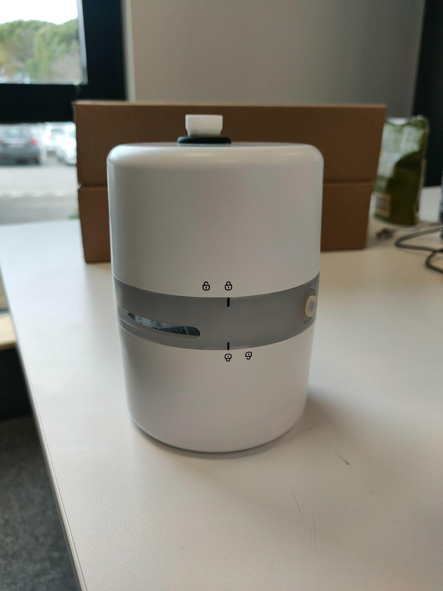
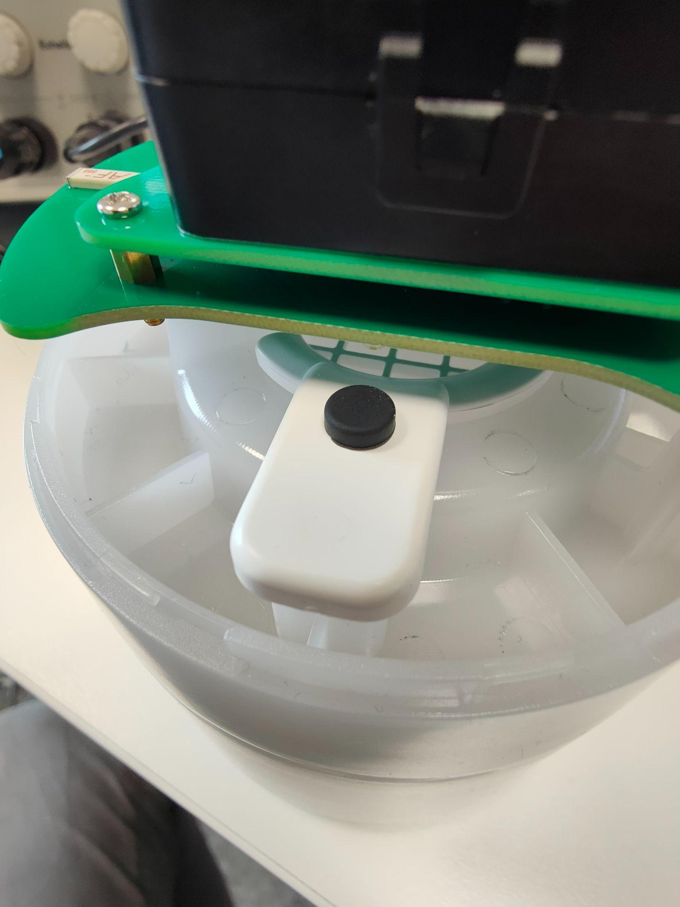
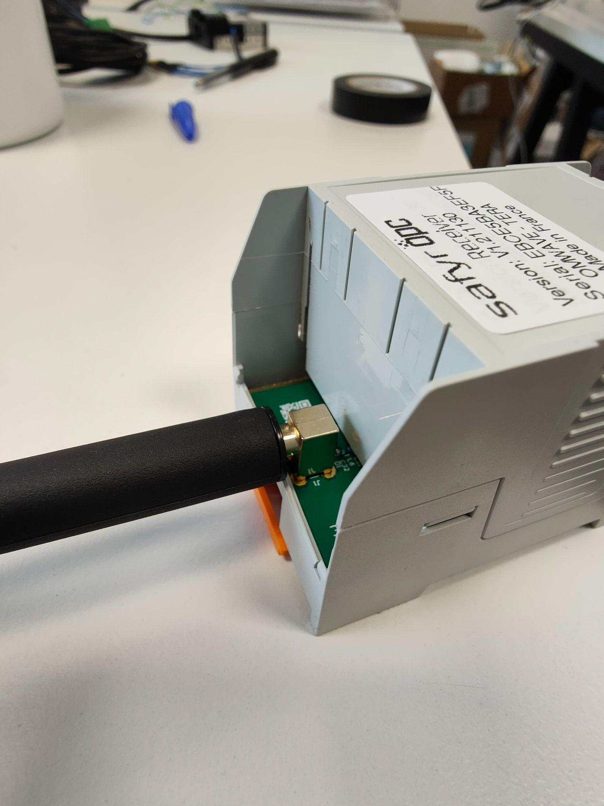
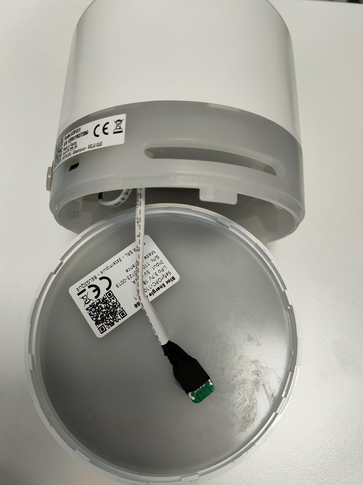
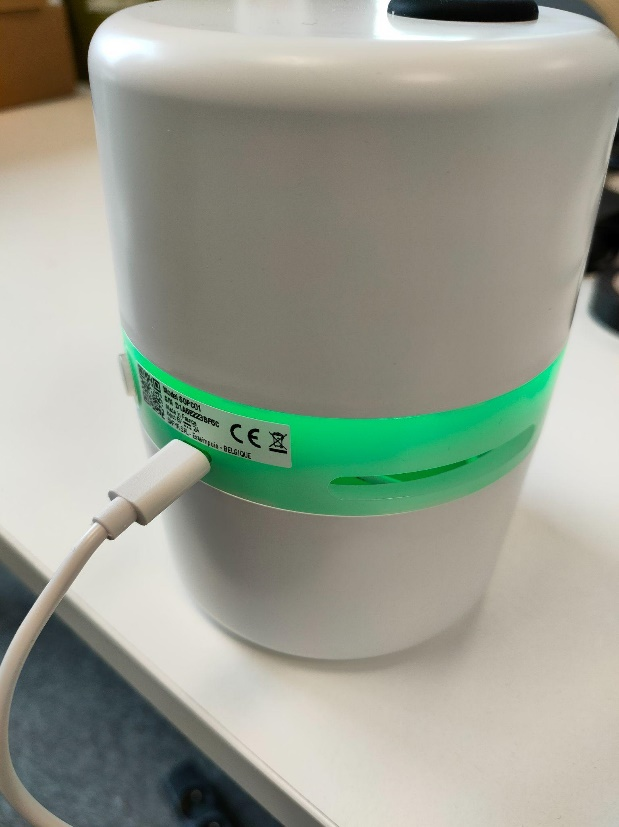
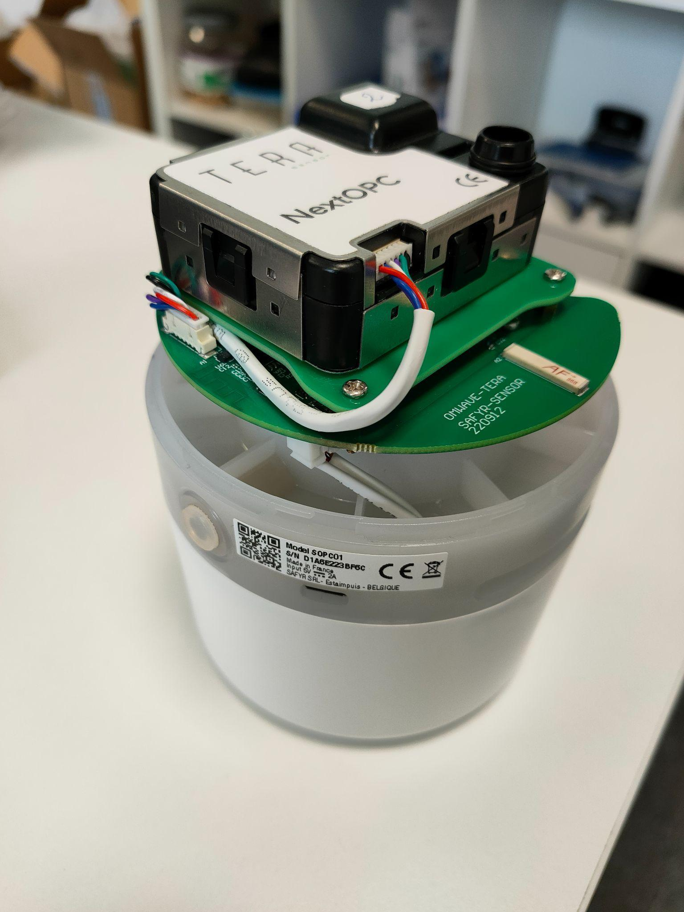
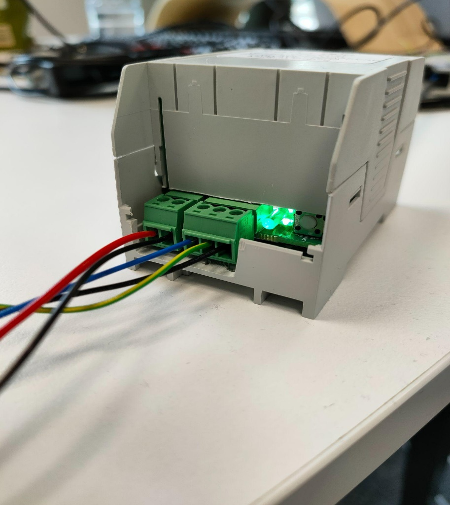

# SafyrOPC User Guide

## 1. Caution & warranty exceptions 

* This product is not intended for use by children or disable person, only by qualified personnel ;
* Do not use if T°>35°C ;
* Do not use near a heat / flammable source ;
* Do not expose to the sun ;
* Do not place on an uneven or inclined surface ;
* Do not immerse the product in liquid ;
* Do not hit or damage your device ;
* Do not disassemble the product (unless otherwise specified in the manual) ;
* Do not insert foreign bodies into the holes ;
* This product is not intended for use by children or disable person, only by qualified personnel ;
* Do not use tools to disassemble the product ;
* Carry out annual maintenance of the product (cleaning the isokinetic probe, checking and changing the Sensor SAFYR OPC, changing the filter).

### **1.1 Battery pack disposal**

• The battery must be removed from the appliance before it is scrapped

• The appliance must be disconnected from the supply mains when removing the battery

• The battery is to be disposed of safely

• Battery unit model number: Bloc Energie SB, SafyrOPC-SB1

• To remove the battery gently turn the base unit to detach it.

• Contact your regional authorities for more details.

### **1.2 Damages not covered by standard warranty**

• Damages caused by an improper use of the product such as shocks, drops, exposition to extreme temperatures, dust, or humidity, or any other cause.

• Damages resulting from any non-respect of manufacturer instructions.

• Cosmetic damages such as scratches, paint, glue or any other alteration made to the product.

• Damages to the product after a repair or disassembly from non authorized personal.

### **1.3 Copyright and other legal information**

SAFYR is a registered trademark. Other trademarks mentioned herewith are owned by their proprietors. All other product or service names are the property of their respective owners.

The use of wireless devices and their accessories may be prohibited or restricted in certain areas. Always obey the laws and regulations on the use of these products.

This product is covered by a 1-year product warranty which is valid from the date of purchase. Users are not permitted to make changes or modify the device in any way. Changes or modifications not expressly approved by the party responsible for compliance will void the user’s warranty.

Please visit our website [www.optical-particle-counter.com](http://www.optical-particle-counter.com/) for more information.

© SAFYR, 2023

SAFYR, 145 Porte des Bâtisseurs • 7730 Estaimpuis - BELGIQUE

**European Union Directives Conformance Statement**

Hereby, SAFYR declares that this product is in compliance with:

.png>)**•** The essential requirements and other relevant provisions of RED Directive 2014/53/UE

**•** All other relevant EU Directives

You can view your product’s Declaration of Conformity (DoC) at [https://www.optical-particle-counter.com](https://www.optical-particle-counter.com/).

**Caring for the environment by recycling**

.png>)Do not dispose of electrical devices or accessories with your household waste.

In some countries or regions, collection systems are set up to handle electrical and electronic waste items. Contact your regional authorities for more details.

***

## 2. System description 

### 2.1 Introduction 

The system is composed of one Safyr OPC Receiver and at least one Safyr OPC. They exchange information wirelessly using Lora technology and a proprietary protocol that offer long range connectivity.

<figure><figcaption></figcaption></figure>

The Safyr OPC is deployed into the environment where the user needs to make particulate matter concentration measurements.

The Safyr OPC Receiver, which communicates with one or several Safyr OPC devices, lets the user get the particulate matter concentration measurements, at distance.

Each Safyr OPC Receiver can be connected **up to 58 Safyr OPC devices** working simultaneously. A Safyr OPC Receiver can be connected to a Safyr OPC up to **150 meters** away in an open field.

Thanks to its multiband functionality, there can be up to **5 systems** (Safyr OPC Receiver+Safyr OPC(s)) working simultaneously without any perturbation.

The LoRa communication is based on the frequency band of 869.5 MHz. If the band is already used by other devices, it could perturbate the communication and create periodically loss of measurements.

### 2.2 Subsystems description 

#### 2.2.1 Safyr OPC 

Below is an exploded view of the Safyr OPC device giving the name of each important part and their location.

.png>)

To change the filter or the Safyr OPC sensor or remove the lower part containing the battery pack to be charged, both the upper and the lower part of the casing can be opened. There are lock symbols (both opened and closed) on the upper and lower part as well as black strokes on the light circle to show how to align the upper or lower part with the light circle to correctly close the Safyr OPC. The black strokes must face the closed locks for the Safyr OPC to be correctly closed.

A picture of the properly closed Safyr OPC casing is shown below.

Before opening the upper part of the Safyr OPC, it is important to remove the isokinetic probe and to put it back only after having closed the upper part of the Safyr OPC.

The SAFYR OPC Sensor and the filter are placed in the upper part of the Safyr OPC. A small black piece is maintaining the filter support in position as shown in the picture below. When changing the filter, it is recommended to take off the filter support slowly in order not to lose the small black piece holding it in place.

Removal of the used filter :

.png>)

Integration of the new filter :

.png>)

The air which contains the particles is sucked from the Safyr OPC isokinetic probe located at its top. This same air, filtered, is exhausted by the Safyr OPC on its 2 outlets located on the sides of the middle ring. Those slits must not be obstructed.

#### 2.2.2 Safyr OPC Receiver 

The casing of the Safyr OPC Receiver is not designed to be opened.\
On one side of the casing, there is the antenna used to communicate with the Safyr OPCs.

On the other side, there are the screw terminals used for power supply and serial communication, the LED showing the Safyr OPC Receiver status and a button used for 2.4 GHz communication with the Safyr OPC Receiver. The 2.4 GHz communication is used for flashing a new version of the firmware or to change several parameters as described further in this document.

### 2.3 Battery 

While the Safyr OPC Receiver must be connected to a 5V power supply, the Safyr OPCs could work with or without its battery pack.

#### 2.3.1 Autonomy 

A fully charged battery can supply a Safyr OPC for a maximum of 168 h

#### 2.3.2 Charging time 

The battery of the Safyr OPC may be charged inside the device or aside from its device. Charging a fully discharged battery can take up to 24 hours.

A green LED at the center of the battery, under the diffusive layer, indicates the status of the charge: while the battery is still charging, the LED is blinking and it turns on continuously when the battery is fully charged.

***

## 3. LEDs indicators 

### 3.1 At power on 

Immediately after their power on, the LEDs Safyr OPC and LEDs Safyr OPC Receiver indicate the user on which radio channel they have been configured.

.png>)

Note: each time is in milliseconds.

### 3.2 After power on 

#### 3.2.1 Safyr OPC 

Once the Safyr OPC is powered on, after the first sequence which indicates on which radio channel the device is configured to communicate in, those same LEDs let the user know the Safyr OPC status, as described in the table below:

.png>)

#### 3.2.2 Safyr OPC Receiver 

Once the Safyr OPC Receiver is powered on, after the first sequence which indicates on which radio channel the Safyr OPC Receiver is configured to communicate in, the same LED blink every second in green color. The Safyr OPC Receiver turns the color into white during one blink when it has received data from a Safyr OPC connected to it.

***

## 4 Electrical connection 

### 4.1 Safyr OPC devices 

The Safyr OPC is powered by its own internal battery located at the bottom of the device, under the light circle.

As shown in the picture below, the battery is connected to the Safyr OPC with a USB-C cable

This battery can be charged directly through the USB-C without being connected to the Safyr OPC. This allows the battery to be charged apart from the device and then swap the near empty battery with a fully charged battery.

<figure><figcaption></figcaption></figure>

The Safyr OPC can also be powered by an external power source with a USB-C cable as shown in the picture above.

When a Safyr OPC is externally connected as well as connected to its internal battery, the Safyr OPC will operate and the battery will charge. In this case, the battery will charge significantly slower than if it was solely connected externally.

### 4.2 SAFYR OPC Sensor 

The SAFYR OPC Sensor is in the upper part of the Safyr OPC as shown in the picture below.

The sensor is connected using a 6 pin Molex connector.

### 4.3 Safyr OPC Receiver 

<figure><figcaption></figcaption></figure>

The Safyr OPC Receiver is wired using 2 screw terminals. A 2 pin terminal is used for the power supply and a 3 pin terminal is used for the serial communication. The picture below shows these screw terminals.

These screw terminals are Phoenix Contact’s MC 1.5 / 2-ST-3.81.

A schematic of the Safyr OPC Receiver is given below to illustrate the wiring.

<figure><figcaption></figcaption></figure>

#### 4.3.1 Power supply 

The Safyr OPC Receiver is powered by an external power supply using the 2-pin screw terminal.\
The Vcc input is a 5V input.

#### 4.3.2 Serial communication 

The Safyr OPC Receiver communicates with the user with a serial communication RS485. The 3-pin terminal is used for the wiring as shown in the previous figure.

This serial communication uses Modbus protocol as described in the next section.

***

## 5. Communication 

### 5.1 Request frame 

In order to get the concentration measured by a connected Safyr OPC to the Safyr OPC Receiver, the user must send a Modbus request to that Safyr OPC Receiver.

The serial communication is configured as follow: 115 200 baud rate (by default), with an even parity and 1 stop bit.

The format of the frames are defined by the Modbus standard and the content is defined below:

* 0x13 0x03 0xB9 0x00 0x00 0x15 CRC1 CRC2 where:
* 0x13 is the Modbus address of the Safyr OPC Receiver, by default.
* 0x03 is the code function, 0x03 is for reading holding registers. This code function should always be used.
* 0xB9 is the address of the Safyr OPC to communicate with. It corresponds to the last 2 digits of the Safyr OPC serial number.

<figure><figcaption></figcaption></figure>

Note: 2 Safyr OPC devices having the same serial number ending should not be connected to the same Safyr OPC Receiver.\

● 0x00 is the first register to access. It could be changed up to the 0x14, but the 2 next fields (number of registers) should be filled in accordingly.

● 0x00 0x15 is the number of registers to access. It could be changed to get a lower number of registers but could not be higher than 0x00 0x15.

● CRC1 & CRC2 are the 2 checksum bytes in modbus CRC16 (Cyclic Redundancy Check).

### 5.2 Safyr OPC Receiver reply 

#### 5.2.1 Frame decoding 

After sending the request described above, the Safyr OPC Receiver will reply by the following frame, whose the format is also defined by the Modbus standard and whose the content is the following: 0x13 0x03 0x2A 0x04 0x0C .. DATAS .. CRC1 CRC2, where:

* 0x13 is the Modbus address of the Safyr OPC Receiver, by default.(could by reconfigured with nRF connect application, see corresponding chapter)
* 0x03 is the code function, 0x03 is for reading holding registers. This code function should always be used.
* 0x2A is byte count
* DATAS are&#x20;

<figure><figcaption></figcaption></figure>

#### 5.2.2 Error frame 

Here are the list of frames returned by the Safyr OPC Receiver in case of wrong command sent by the user:

● 13 83 11 21 39: registers number too high

● 13 83 11 21 39: non existing first register (value higher than 0x14)

● no answer if wrong Modbus address

● no answer if wrong function code (different from 0x03)

### 5.3 Safyr OPC Status 

The Safyr OPC status register corresponds to the status of the sensor embedded into the Safyr OPC device. This status allows the user to know the internal error of the Sensor Safyr OPC.

<figure><figcaption></figcaption></figure>

If there is no communication with a Safyr OPC Sensor (Safyr OPC Sensor missing in the Safyr OPC or not well plugged), the Safyr OPC Sensor status sent back by the Safyr OPC Receiver is 0x7F 0xFF and all the registers corresponding to measurements are fixed at 0xFF 0xFF.

In that case and if there is one internal error into the embedded Sensor Safyr OPC, the LED indicator will have the behavior described in the corresponding chapter.

### 5.4 Communication loss 

#### 5.4.1 Loss of connection between the Safyr OPC and Safyr OPC Receiver 

When a Safyr OPC has no (or no more) communication with a Safyr OPC Receiver (see following cases), the Safyr OPC stores its own measurement in order to let the user retrieve them at the communication restoration.

For this, each Safyr OPC has an internal buffer in which the data is stored during a loss of a connection with the Safyr OPC Receiver.

It could happen when:

* the Safyr OPC is out of range of the Safyr OPC Receiver
* the Safyr OPC Receiver is out of range of the Safyr OPC
* the Safyr OPC has no Safyr OPC Receiver in the same radio channel
* the Safyr OPC Receiver associated to this Safyr OPC has been turned off

When this happens, the Safyr OPC stores up to 15 measurement data, meaning a 15 minutes of storage maximum. If the loss of connection lasts more than that time, the Safyr OPC replaces the older data with a new one, as illustrated below.

When the connection is restored, the Safyr OPC sends **every 30 seconds alternatively new data and data stored** up to totally flush the stored data buffer. The data stored sent first is the more recent one, as illustrated below.

* Nominal behavior with a continuous transmission (every minutes) of data between the Safyr OPC and the Safyr OPC Receiver

<figure><figcaption></figcaption></figure>

* During loss of connection between the Safyr OPC and the Safyr OPC Receiver

<figure><figcaption></figcaption></figure>

* During a recovery of the connection after a 16 min loss of connection

<figure><figcaption></figcaption></figure>

The time counter Register (0) allows the user to know if the data is the current one (new measurement) or an old one. Using this, the user could retrace the chronological order of the measurement data.

When this happens, the user system should be able to trigger a faster Safyr OPC Receiver reading frequency to be synchronized with the Safyr OPC sending frequency ( 2 data every minute), otherwise, the Safyr OPC Receiver stores the data not read by the user and as a consequence, the user may not be able to catch up the current data.

#### 5.4.2 Loss of connection between the Safyr OPC Receiver and the user 

When a Safyr OPC Receiver has no (or no more) communication with a user (see following cases), the Safyr OPC Receiver stores the data received from the Safyr OPC in order to let the user retrieve them at the communication restoration.

For this, each Safyr OPC Receiver has an internal buffer for each Safyr OPC connected to it, in which the data is stored during a loss of a connection with the user machine.

It could happen when:

* the physical link between the Safyr OPC Receiver and the user machine is broken
* the user or the user machine has stopped to ask data to the Safyr OPC Receiver

When this happens, the Safyr OPC Receiver stores up to 15 measurement data, meaning a 15 minutes of storage maximum. If the loss of connection lasts more than that time, the Safyr OPC Receiver replaces the older data with a new one, as illustrated below.

When the connection is restored, the user can ask as frequently as he wants all the data stored into the Safyr OPC Receiver. The older data comes out first, as illustrated below.

* Nominal behavior with a continuous transmission (every minutes) of data between the Safyr OPC Receiver and the user

<figure><figcaption></figcaption></figure>

* During loss of connection between the Safyr OPC Receiver and the user/user machine.

<figure><figcaption></figcaption></figure>

* During a recovery of the connection after a 16 min loss of connection, with 1 minute period of request

<figure><figcaption></figcaption></figure>

The Safyr OPC Receiver buffer is never flushed and the user has a delay (corresponding to the time of connection of loss, or 15min) which can not be caught up.

Thus, the user should put in place a mechanism to make at least 2 requests to the Safyr OPC Receiver every minute to catch up with the current data, as illustrated below.

* During a recovery of the connection after a 16 min loss of connection, with 30 secs period of request

<figure><figcaption></figcaption></figure>

Note: when this happens, if the user asks only for a small part of the registers, the buffer is still flushed and the rest of the register not read are definitely lost. So, the user must read all the registers of a data frame at once.

***

## 6. Parameters configuration and firmware update 

The application nRF connect developed by Nordic Semiconductor is used in 2 separate cases:

* configure some parameters of the Safyr OPC (radio channel) and the Safyr OPC Receiver as well (radio channel, modbus address, speed of the modbus communication, etc… )
* update firmware of the Safyr OPC and the Safyr OPC Receiver

<figure><figcaption></figcaption></figure>

### 6.1 Flashing a new version of the firmware 

Whether it is for flashing the Safyr OPC Receiver or the Safyr OPC, the procedure is the same.

* First you must turn off the Safyr OPC Receiver (or the Safyr OPC) and open the application nRF connect. The screenshot below shows the window that appears.
  * https://play.google.com/store/apps/details?id=no.nordicsemi.android.mcp\&hl=fr\&gl=US\&pli=1 + Lien / CR Code vers le store de l’application

<figure><figcaption></figcaption></figure>

* Then you must press the button and turn it on at the same time. The LED will be continuously green. By refreshing the screen, you will find a new device “DfuTarg” :

<figure><figcaption></figcaption></figure>

* Press “CONNECT” and a new window will open :\
  For the Safyr OPC Receiver, the LED will turn continuously white when the connection is done.\
  For the Safyr OPC, the LEDs will turn orange continuously when the connection is done.

<figure><figcaption></figcaption></figure>

* Press the “DFU” symbol in the top right corner of the screen. A new window will open for you to choose the type of the file you want to flash.

<figure><figcaption></figcaption></figure>

* Select “Distribution packet (ZIP)” and find the archive containing the firmware. Note : The archive must NOT be unzipped.

The new firmware will then be flashed onto the Safyr OPC Receiver (or the Safyr OPC) and a new window will open to show the progress.

While the Safyr OPC Receiver is being flashed, the LED will blink green and white.

While the Safyr OPC is being flashed, the LEDs will blink green and orange.

<figure><figcaption></figcaption></figure>

* When it is finished, the new firmware has been flashed correctly and the Safyr OPC Receiver (or the Safyr OPC) will restart.

### 6.2 Modify parameters 

Whether it is for modifying the parameters of the Safyr OPC Receiver or the Safyr OPC, the procedure is the same.

* Open the nRF Connect application, the following window will open&#x20;

<figure><figcaption></figcaption></figure>

* While the Safyr OPC Receiver (or the Safyr OPC) is operating, press the button on it. For the Safyr OPC Receiver, the LED will start blinking blue. For the Safyr OPC, the LEDs will start blinking orange. By refreshing the screen, a new device will appear as shown below&#x20;

<figure><figcaption></figcaption></figure>

* Press “CONNECT” and a new window will open&#x20;

<figure><figcaption></figcaption></figure>

* Pressing on “Nordic UART Service” will reveal new information. You must press the icon to the right of “TX Characteristic” to have it crossed. Then you can press the icon to the right of “RX Characteristic”, this will open a window (shown below) in which you can write the commands used to modify parameters. You can find every command available in the table below the procedure.

<figure><figcaption></figcaption></figure>

* For the end of this explanation, the command used to change the communication channel will be used as an example. This command is : “&0/SN:05(line break)”. This command sets the device to use the communication channel number 5, there are 5 channels available, you just need to change the number in the command line. (range : 01 - 05).

IMPORTANT NOTE : It is necessary to insert the line break at the end of the command line. You can press “SEND” to send the command.

<figure><figcaption></figcaption></figure>

* When you are back to the screen with Nordic UART Service, you can swipe to the right to open a window showing every communication with the device.

In the following screenshot, you can see that a ping “Alive” is sent every 5 seconds to show that the device is still connected. You can also see that the command “&0/SN:05(line break)” has been sent and beneath that, you can see that the device answered with a “&0/A:0(line break)” which is an acknowledgement (ACK) that the command has worked.

Table of the commands available :

| Command Line                    | Explanation                                                                                                                                                                                                                                                                                              |
| ------------------------------- | -------------------------------------------------------------------------------------------------------------------------------------------------------------------------------------------------------------------------------------------------------------------------------------------------------- |
| 
“&#x26;0/SN:0X

”
   | X = \[1;5] This command sets the communication channel to number X                                                                                                                                                                                                                                       |
| 
“&#x26;0/GN

”
      | 
This command asks the device which communication channel it is set on.

The device should answer with a GN:0X
                                                                                                                                                                                |
| 
“&#x26;0/SB:XXXX

”
 | 
SAFYR OPC RECEIVER ONLY :

XXXX = [1200, 2400, 4800, 9600, 14400, 19200, 28800, 31250, 38400, 56000, 57600, 76800, 115200, 230400, 250000, 460800, 921600]

115200 is the default value.

This command sets the baud rate of the serial communication with the Safyr OPC Receiver.
 |
| 
“&#x26;0/GB

”
      | 
SAFYR OPC RECEIVER ONLY :

This command asks the Safyr OPC Receiver which baud rate it is set on for the serial communication.

The Safyr OPC Receiver should answer with a GB:XXXX
                                                                                                     |
| 
“&#x26;0/SA:XX

”
   | 
SAFYR OPC RECEIVER ONLY :

XX is an hex value. This command sets the modbus address of the Safyr OPC Receiver.

Default value is 0x13.
                                                                                                                                                  |
| 
“&#x26;0/GA

”
      | 
SAFYR OPC RECEIVER ONLY :

This command asks the Safyr OPC Receiver what is its modbus address.

The Safyr OPC Receiver should answer with a GA:XX
                                                                                                                                      |

Table of answers from the device :

| Answer Line                        | Explanation                                                                                                                                                                       |
| ---------------------------------- | --------------------------------------------------------------------------------------------------------------------------------------------------------------------------------- |
| 
“&#x26;0/A:0

”
        | This is an acknowledgement (ACK) of the command sent before                                                                                                                       |
| 
“&#x26;0/A:1

”
        | 
This is a NOT acknowledged answer (NACK) of the command sent before.

It means that the device either did not understand the command or could not execute it.
         |
| 
“&#x26;0/Evt Move:Y

”
 | 
SAFYR OPC RECEIVER ONLY :

This is an answer to the command GB

This answer shows which baud rate the Safyr OPC Receiver is set on for the serial communication.
 |
| 
“&#x26;0/GN:0X

”
      | 
This is an answer to the command GN

X = [1;5] This answer shows on which communication channel the device is set on.
                                                 |
| 
“&#x26;0/GB:XXXX

”
    | 
SAFYR OPC RECEIVER ONLY :

This is an answer to the command GB

This answer shows which baud rate the Safyr OPC Receiver is set on for the serial communication.
 |
| 
“&#x26;0/GA:XX

”
      | 
SAFYR OPC RECEIVER ONLY :

This is an answer to the command GA

This answer shows what is the modbus address of the Safyr OPC Receiver.
                          |

***

## Revision history

| Version | Date       | Author         | Update(s)                           |
| ------- | ---------- | -------------- | ----------------------------------- |
| v0      | 13/01/2023 | G.JANIN        | 
Creation

Draft version
 |
| v1      | 01/02/2023 | Julien Robidet | First version                       |
| V1.2    | 04/07/2023 | Antoine Dumas  | Caution & warranty exception added  |
|         |            |                |                                     |
|         |            |                |                                     |
