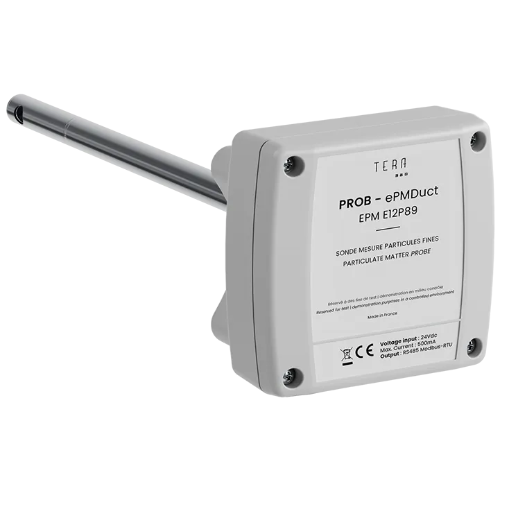

# PMDUCT

<figure><figcaption></figcaption></figure>

<table><thead><tr><th width="284">Designation</th><th>Values</th></tr></thead><tbody><tr><td><strong>GENERAL</strong></td><td></td></tr><tr><td><strong>Measured parameters</strong></td><td>
PM1/PM2.5/PM10 in µg/m3

Temperature in °C

Relative Humidity in %
</td></tr><tr><td><strong>PM Concentration Range</strong></td><td>0 - 10 000 µg/m3</td></tr><tr><td><strong>PM Size Detection range</strong></td><td>0.3 µm to 10 µm</td></tr><tr><td><strong>PM Repeatability</strong></td><td>&#x3C; 3%</td></tr><tr><td><strong>Communication</strong></td><td>RS485 to PLC or Gateway system</td></tr><tr><td><strong>Internal Pumping System</strong></td><td>Optimized to operate even for high air speed rate</td></tr><tr><td><strong>Measurement frequency</strong></td><td></td></tr><tr><td>Normal Mode</td><td>1 measure every 15 minutes</td></tr><tr><td>Forced Mode</td><td>Continuous (maintenance time impacted)</td></tr><tr><td><strong>Maintenance</strong></td><td>
Every 2 years with Sensor Kit achievable on site

(without service interruption)
</td></tr><tr><td><strong>Power supply</strong></td><td>
24 V (+/- 10%) - &#x3C;0.5 A

(Other voltages available)
</td></tr><tr><td><strong>Dimensions and weight</strong></td><td>H 121 mm x L 116 mm x P 73 mm (+ tubing) | &#x3C; 1kg</td></tr></tbody></table>

## Mechanical specifications

<figure><figcaption></figcaption></figure>

