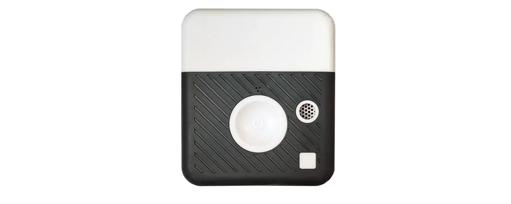

# PMSCAN datasheet

<figure><figcaption></figcaption></figure>

| Designation                     | Values                                                                                                    |
| ------------------------------- | --------------------------------------------------------------------------------------------------------- |
| **GENERAL**                     |                                                                                                           |
| Measured parameters             | 
PM1/PM2.5/PM10 in µg/m3

Temperature in °C

Relative Humidity in %

Battery Level
   |
| **PERFORMANCE**                 |                                                                                                           |
| PM Concentration Range          | 0 - 1000 µg/m3                                                                                            |
| Particle Size detection range   | 0.3 µm to 10µm                                                                                            |
| PM Repeatability                | < 3%                                                                                                      |
| **COMMUNICATION**               |                                                                                                           |
| Type                            | Low consumption radio communication                                                                       |
| Measure/ Transmission Frequency | From 1 second up to 5 minutes                                                                             |
| Communication Options           | Moving Average 10 - 60 - 900 sec                                                                          |
| **ENERGY**                      |                                                                                                           |
| Power                           | 
USB C

5 V (+/- 10%) - 1A. Do not apply voltage over 13V at the risk of destroying the sensor
 |
| Battery life Normal Mode        | 15 hours                                                                                                  |
| Eco Mode                        | > 20 hours                                                                                                |
| **MEMORY**                      |                                                                                                           |
| Internal memory                 | Data acquisition 6145 points (total duration depending on frequency)                                      |
| DIMENSIONS / WEIGHT             | H 88 mm x L 76 mm x P 36 mm \| 210 gr                                                                     |

<figure><figcaption></figcaption></figure>

