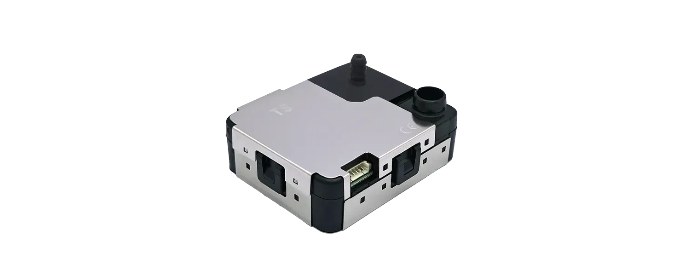
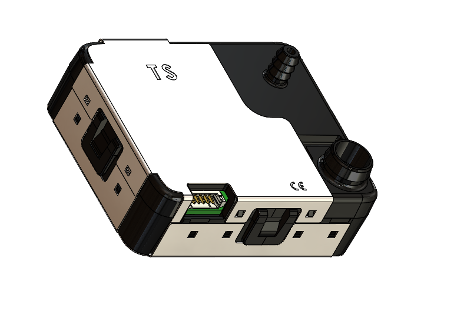
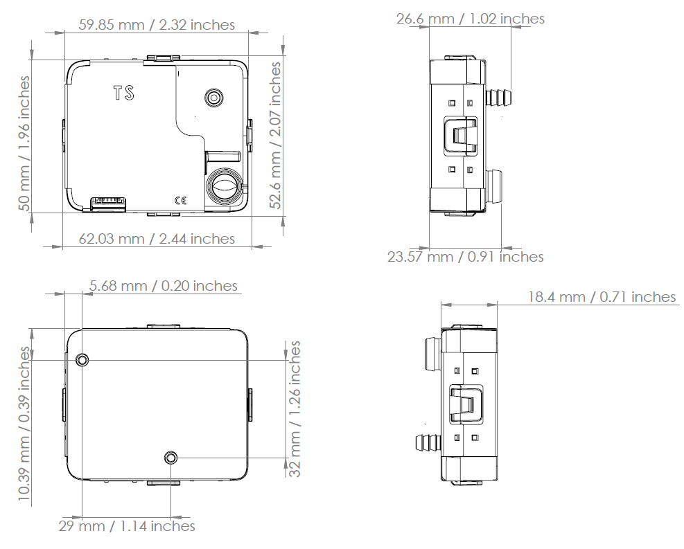

# NextPM Advanced Datasheet

<figure><figcaption></figcaption></figure>

| **Designation**                                                                      | **Values**                                                                                  | **Units**                                                                                    |
| ------------------------------------------------------------------------------------ | ------------------------------------------------------------------------------------------- | -------------------------------------------------------------------------------------------- |
| **GENERAL**                                                                          |                                                                                             |                                                                                              |
| Technology                                                                           | Optical                                                                                     | -                                                                                            |
| Targeted pollutants                                                                  | Particulate Matter                                                                          | -                                                                                            |
| Outputs                                                                              | 
PM₁

PM₂.₅

PM₁₀

TSP ¹

Temperature ²

Relative Humidity ²
 | 
<em>µg/m³ &#x26; pcs / L</em>

<em>µg/m³ &#x26; pcs / L</em>

<em>µg/m³ &#x26; pcs / L</em>

<em>µg/m³</em>

<em>°C</em>

<em>%</em>
 |
| Airflow ³                                                                            | 1.2                                                                                         | _L/min_                                                                                      |
| Size (l \* w \* h)                                                                   | Annex 1                                                                                     | _mm / Inches_                                                                                |
| Lifetime (MTTF)                                                                      | > 10 000                                                                                    | _hours_                                                                                      |
| **PERFORMANCE**                                                                      |                                                                                             |                                                                                              |
| Particle Size detection range                                                        | 0.3 - 10                                                                                    | _µm diameter_                                                                                |
| Detection efficiency with 0.3 µm diameter particles                                  | > 50                                                                                        | %                                                                                            |
| 
Concentration detection range /

PM₁₀ - PM₂.₅ - PM₁

TSP
            | 
0 - 10 000

0 - 40 000
                                                          | _µg/m³ (Arizona dust A1 equivalent)_                                                         |
| Detection Limit                                                                      | < 1                                                                                         | _µg/m³ (Arizona dust A1 equivalent)_                                                         |
| Linearity error                                                                      | < 5                                                                                         | _%_                                                                                          |
| Repeatability error ⁴                                                                | < 3                                                                                         | _%_                                                                                          |
| Refresh rate                                                                         | 1 / 10 / 60                                                                                 | _sec._                                                                                       |
| Warm-up time                                                                         | 10                                                                                          | _sec._                                                                                       |
| 
Temperature influence

0°C to 30°C

-20°C to 0°C

30°C to 70°C
 | 
0

&#x3C; + 1,0

&#x3C; - 0,8
                                              | _%/°C_                                                                                       |
| **ELECTRIC SPECIFICATIONS**                                                          |                                                                                             |                                                                                              |
| Power supply                                                                         | 5                                                                                           | VDC                                                                                          |
| Power consumption in operation                                                       | 
&#x3C; 50

270
                                                                  | 
mA

mA (Maximum)
                                                                 |
| Power consumption in Sleep Mode                                                      | < 20                                                                                        | mA                                                                                           |

| **COMMUNICATION**       |                                                                                            |                   |
| ----------------------- | ------------------------------------------------------------------------------------------ | ----------------- |
| UART / Modbus (RS485) ⁵ | Download NextPM User Guide for more informations                                           |                   |
| **OTHER**               |                                                                                            |                   |
| Operating conditions    | 
-20 à +70

253 to 343
                                                          | 
°C

K
 |
| 0 - 95 uncondensed      | %                                                                                          |                   |
| 500 to 1500             | hPa                                                                                        |                   |
| Storage conditions      | -20 to +70                                                                                 | °C                |
| 0 - 95 uncondensed      | %                                                                                          |                   |
| 500 to 1500             | hPa                                                                                        |                   |
| Certifications          | CE                                                                                         |                   |
| RoHS compliant          |                                                                                            |                   |
| Dimensions and weight   | 
L 62 mm x l 52 mm x H 26.6 mm | 45 g

L 2,4 / W 2,07 / H 1,02 inches | 1.59 Oz
 |                   |

_¹ Calculated based on other PM detection and validated on field measurements._

_² See the NextPM User Guide for more information about these data._

_³ Airflow of 1.2 L/min provided by the external pumping system._

_⁴ Calculated on the fifteen-minute moving average output._

_⁵ The sensor needs a converter for RS485 communication — see the NextPM Advanced User Guide for more information._

### Mechanical specifications 

