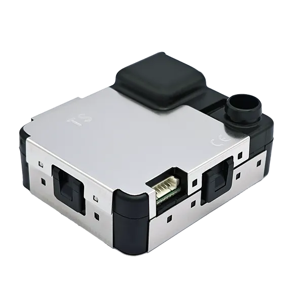
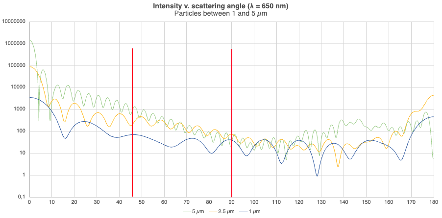
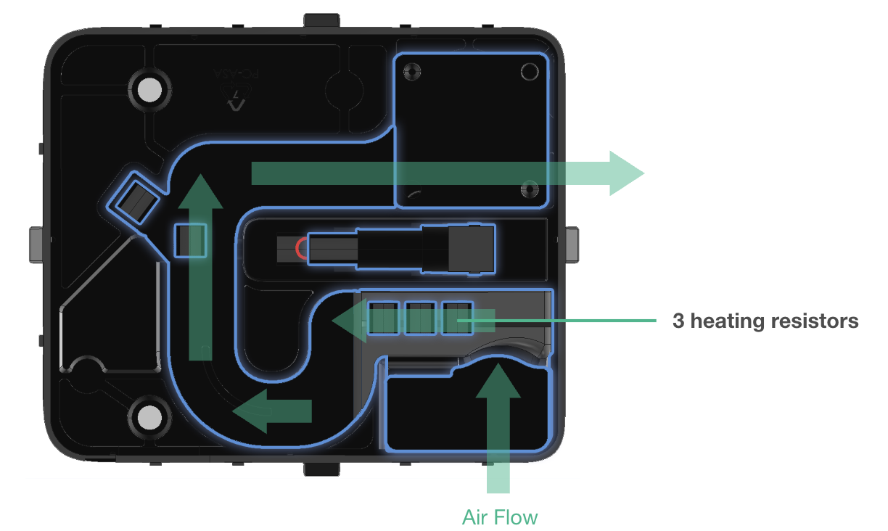
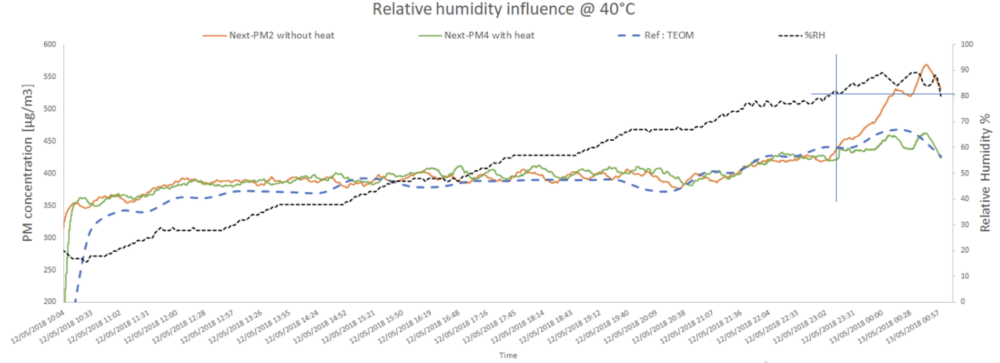

# Introduction to NextPM

## &#x20;1. About NextPM

<figure><figcaption></figcaption></figure>

NextPM has been designed to comply with the **highest quality standards** for particulate matter monitoring.

With **3 patents** to provide the best quality, size and price compromise, NextPM gives you **real time PM1, PM2.5 and PM10** in numbers or mass.

NextPM is a genuine technical wonder. It integrates more than **20 years of experience** of Groupe TERA in the field of air quality measurement.

NextPM is the only sensor which design incorporates elements to **limit clogging** of the sensors, thereby **extending their lifetime** with minimum maintenance.

To ensure the performance of our sensors, **strict quality controls** are carried out at every stage of the manufacturing process, from the components to the final product.

.png>)

## 2. Difference between number and mass concentration

The particles with the greatest impact on health are the finest (< 1 µm) because they penetrate more deeply into the respiratory system and are measured by PM1.

However, if we compare the number and mass distributions for dust, we can see that these particles are in the majority in terms of number (> 80%), even though in terms of mass they represent less than 5%.

.png>)

This distribution of size is dependent on the emission sources and discrimination is made possible by the 5 channels of NextPM.

For example, the picture below shows the size of different kinds of particles in industrial applications.

.png>)

***

## 3. The Mie theory

The NextPM detection is based on the optical Mie’s Theory of light diffraction to calculate particle size.

<figure><figcaption></figcaption></figure>

***

## 4. Accuracy: 2 detection angles

Because Mie theory can introduce detection errors with a single angle, NextPM integrates 2 photodetectors which allow it to measure the light diffusion at 2 angles: 45° and 90°.

**This feature is unique in this category of optical sensors.**

<figure><figcaption></figcaption></figure>

As a demonstration, these polar plots show the Intensity diffracted function of the detection angles. We see that for particles of 1µm and 2.5 µm, there is little difference at 90°. It is very important to discriminate properly these two sizes as mass concentrations PM1 and PM2.5 are two key measurements.

<figure><figcaption></figcaption></figure>

These 3 curves representing the intensity depending on the particle size and the scattering angle (for a 650 nm wavelength) confirm that the discrimination for particles from 1 to 5 µm is inappropriate at 90° only.

| **Intensity** | **45°** | **90°** |
| ------------- | ------- | ------- |
| 0.3 µm        | 10.75   | 0.31    |
| 1 µm          | 71.11   | 40.14   |
| 2.5 µm        | 179.44  | 73.76   |
| 5 µm          | 580.22  | 32.09   |
| 10 µm         | 5742.39 | 146.08  |

Comparing the intensity at 2 angles, it confirms that 2 photodetectors allow to increase the accuracy of the measurement by the discrimination of the particles’ size.

For the smallest particles, even if the diffraction is weak, it is detectable at 45°.

***

## 5. Reliability: humidity regulation

High Relative Humidity (RH) will have a strong effect on light scattering considering three effects on the particle’s properties:

1/ to enlarge particle size with the hygroscopic factor

2/ to reduce the particle refractive index from 1.7 to 1.4 as the refractive index of water is lower

3/ to smooth the particle’s shape through the absorption of water

When RH is higher than 62%, particle-bound water increases. The particle’s mass will increase when RH exceeds 65% and will increase sharply when RH exceeds 80%, which can lead to the overestimation of PM.

A second effect of high RH is to increase the clogging risk as particles with an outside layer of water will easily stick to the pathflow wall and to the detection surface of the photodetectors.

The solution implemented in NextPM is the use of heaters to remove aqueous components: 3 heating resistors are located at the inlet of the sensor.

A unique and worldwide patent to keep the humidity inside the sensor under 60% and keep a homogeneous temperature while increasing the sensor life.

### 5.1 Heater effects: measurement on-field (French Brittany)

To validate the efficiency of the heating device, measurements were done in Brittany. From 18/10/2020 to 09/11/2020, relative humidity alternatively exceeded 60%, to reach a level higher than 80% most of the time.

Under 80% RH, there is little difference between concentrations measured by NextPM (with and without heating) which slightly underestimate the PM2.5/PM10. But as soon as we exceed 80%, the NextPM without heater overestimates the PM2.5/PM10 concentration compared with the reference sensor (Beta Gauge) whereas the heater one stands still against the humidity effect.

<figure><figcaption></figcaption></figure>

<figure><figcaption></figcaption></figure>

***

## 6. Lifetime: Anti-clogging flow design

An aeraulic filter at the inlet of the sensor :

* Unique feature avoiding the use of an additional physical filter
* Improving the sensor lifetime by avoiding premature clogging of the flow
* Filter blocking particles > 10 µm
* Flow laminarization elements to manage the direction of the airflow

<figure><figcaption></figcaption></figure>

NB : The capacity volume of the dust tray is enough to trap 10 years of continuous measurement at 150 µg/m3 TSP.

### **6.1 Laboratory high concentration test results:**

During this test 0,50g of particle mass went through the sensor which corresponds to 2 times the amount of particles that the sensor would be exposed to if placed in Beijing with a PM2.5 Mean of 120 µg/m3.

Following the test we can see that there is no accumulation in the internal parts of the sensor. The flow is not affected.

<figure><figcaption></figcaption></figure>

There is also no dust on photodetectors allowing the sensor to keep an efficient accuracy.

The drift measured on the sensor stayed <20%:

| **Parameter** | **Drift** |
| ------------- | --------- |
| PM1           | -15%      |
| PM2,5         | -16%      |
| PM10          | -18%      |
| Flow          | -3,5%     |

***

## 7. Lifetime: Specific plastic and home design components

Clogging will not only have an impact on counting efficiency, as particles can be released and dirty photodiodes lose accuracy, but will also lead to premature ageing of the fan. The specific properties of the casing are therefore important in limiting clogging of the sensor.

All the NextPM components (laser, fan, heaters) are home designed to fit with the specifications given for the best detection.

In the same way, the casing was manufactured with a **specific plastic including custom properties**, which has given the best results in the various quality tests carried out by TERA.

<figure><figcaption></figcaption></figure>

***

## 8. Strict quality control: From the components to the final product

The NextPM quality control procedure is the same for critical components and final products.

It comprises 4 processes:

1/ Reception of the lots of components (fans, lasers, casings) or NextPM

2/ Random sampling for quality control in accordance with ANSI/ASQ Z1.4-2003 (R2018), LEVEL III

Test in our laboratory @Rousset

Verification of calibration parameters for PM2.5 with a polydisperse standard aerosol comprising the size range of 0,1 µm to 10 µm.

<figure><figcaption></figcaption></figure>

3/ Tests according to internal protocols - determination of the number of non-compliant cases according to 3 thresholds (Minor, Major, Critical)

4/ Validate or invalidate the batch

**The NextPM Quality control includes:**

Electronic and communication control

Visual inspection of assembly

Cleanliness

<figure><figcaption></figcaption></figure>

NextPM Production Process

(made in France)

<figure><figcaption></figcaption></figure>

***

## 9. Internationally verified: AQ-SPEC reports

The South Coast AQMD is a Californian regulatory agency responsible for improving air quality. The South Coast AQMD has established the Air Quality Sensor Performance Evaluation Center (AQ-SPEC) program which aims at performing a thorough characterization of currently available “low-cost” sensors under ambient (field) and controlled (laboratory) conditions.

NextPM is one of the sensors tested and validated by AQ-SPEC. Reports are available on line: [https://www.aqmd.gov/sensors/tera-sensor---nextpm](https://www.aqmd.gov/sensors/tera-sensor---nextpm)

Field evaluation highlights:

<figure><figcaption></figcaption></figure>

[Read the full report](https://tera-sensor.com/wp-content/uploads/2023/09/tera-sensor-nextpm-field-evaluation_compressed.pdf)

***

## 10. Tested by French institution: LCE / Atmosud report

Context : Daily average of PM 2.5 measurement.

Method : Comparison of the performance of our NextPM with the Reference instrument (certified analyser) for 2 consecutive weeks.

Results : the NextPM correlation coefficient with the certified analyzer for PM1, PM2.5 and as well PM10 is very high > 0.95. It means that the NextPM could be able to measure particles as well as a reference instrument, almost a 1000 times more expensive, for daily use. This first step in the study of NextPM field performances shows that the technology is very reliable and has a high measurement accuracy, near the performances of the certified method in an uncontrolled environment. Also, the technology has almost the same performance for the real time measurement of the three PM fractions, PM1, PM2.5 and PM10.

<figure><figcaption></figcaption></figure>

[Read the full report](https://tera-sensor.com/wp-content/uploads/2023/09/In_Field_study_of_NextPM_sensor_rev2_v1.pdf)

Contacts

<figure><figcaption></figcaption></figure>

| **Groupe sales Director**      | **CTO**                       | **International Sales Manager** |
| ------------------------------ | ----------------------------- | ------------------------------- |
| laurent.debard@groupe-tera.com | antoine.dumas@groupe-tera.com | david.riallant@groupe-tera.com  |
| +33 6 25 45 75 04              | +33 6 85 53 95 25             | +33 6 43 11 36 52               |

[https://www.linkedin.com/company/tera-sensor](https://www.linkedin.com/company/tera-sensor)

[www.tera-sensor.com](http://www.tera-sensor.com/)

***

## References and bibliography

Sensor for measuring the concentration of particles in the air, patent WO/2018/211044

Hu H, Li X, Zhang Y, Li T.

Determination of the refractive index and size distribution of aerosol from dual-scattering-angle optical particle counter measurements. Appl Opt. 2006 Jun 1;45(16):3864-70. doi: 10.1364/ao.45.003864. PMID: 16724151.

Baynard, T., R. M. Garland, A. R. Ravishankara, M. A. Tolbert, and E. R. Lovejoy (2006),&#x20;

Key factors influencing the relative humidity dependence of aerosol light scattering, Geophys. Res. Lett., 33, L06813, doi:[10.1029/2005GL024898](https://doi.org/10.1029/2005GL024898).

Paul M. Cropper , Jaron C. Hansen & Delbert J. Eatough delbert@eatough.net (2013) \
Measurement of light scattering in an urban area with a nephelometer and PM2.5 FDMS TEOM monitor: Accounting for the effect of water, Journal of the Air & Waste Management Association, 63:9, 1004-1011, DOI: [10.1080/10962247.2013.770421](https://doi.org/10.1080/10962247.2013.770421)

Shao, W.; Zhang, H.; Zhou, H.

Fine Particle Sensor Based on Multi-Angle Light Scattering and Data Fusion. _Sensors_ 2017, _17_, 1033. https://doi.org/10.3390/s17051033

Rousset D, Bau S, Matera V, Bemer D, Oury B.\
Métrologie des Particules Fines et Ultrafines en Environnement de Travail\
35e journées nationales de santé au travail dans le BTP

https://www.sistbtp-lorraine.fr/wp-content/uploads/2019/07/Rousset-et-al-SST-BTP-2019-05-23\_vF.pdf
