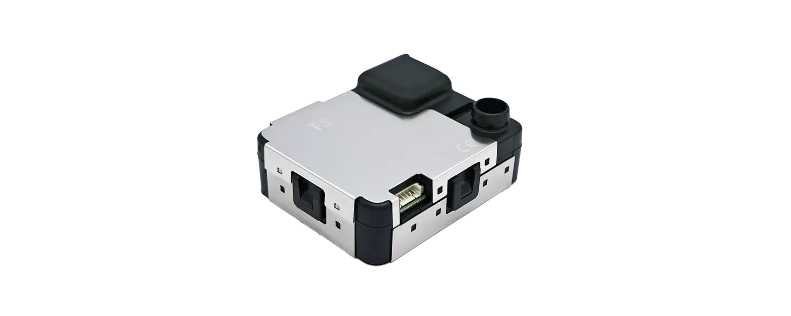


**This platform has moved.** The current version of this page is now published at [tera-sensor.com/resources/nextpm/datasheet/](https://tera-sensor.com/resources/nextpm/datasheet/).


# NextPM datasheet

<figure><figcaption></figcaption></figure>

| Designation                                         | Values                                                                                                                                                                                                                                                     | Unit                                                                                                                                         |
| --------------------------------------------------- | ---------------------------------------------------------------------------------------------------------------------------------------------------------------------------------------------------------------------------------------------------------- | -------------------------------------------------------------------------------------------------------------------------------------------- |
| **GENERAL**                                         |                                                                                                                                                                                                                                                            |                                                                                                                                              |
| Technology                                          | Optical                                                                                                                                                                                                                                                    |                                                                                                                                              |
| Targeted pollutants                                 | Particulate Matter                                                                                                                                                                                                                                         |                                                                                                                                              |
| Outputs                                             | 
PM₁ 

PM₂.₅ 

PM₁₀ 

TSP ¹˒² 

Channel: 0.3 - 0.5 μm¹ 

Channel: 0.5 - 1 μm¹ 

Channel: 1 - 2.5 μm¹ 

Channel: 2.5 - 5 μm¹ 

Channel: 5 - 10 μm¹ 

Temperature ³ 

Relative Humidity ³
 | 
μg/m³ &#x26; number of particles / L

μg/m³ &#x26; number of particles / L

μg/m³ &#x26; number of particles / L

μg/m³

number of particles / L

number of particles / L

number of particles / L

number of particles / L

number of particles / L

°C 

%
 |
| Airflow                                             | 2.5                                                                                                                                                                                                                                                        | L/min                                                                                                                                        |
| Size (l \* w \* h)                                  | Annex 1                                                                                                                                                                                                                                                    | mm                                                                                                                                           |
| Lifetime (MTTF) ⁴                                   | Up to 10                                                                                                                                                                                                                                                   | years                                                                                                                                        |
| **PERFORMANCE**                                     |                                                                                                                                                                                                                                                            |                                                                                                                                              |
| Particle Size detection range                       | 0.3 - 10                                                                                                                                                                                                                                                   | μm diameter                                                                                                                                  |
| Detection efficiency with 0.3 μm diameter particles | >50                                                                                                                                                                                                                                                        | %                                                                                                                                            |
| Concentration detection range / PM₁₀ - PM₂.₅ - PM₁  | 0 - 1000                                                                                                                                                                                                                                                   | μg/m³ (Arizona dust A1 equivalent)                                                                                                           |
|                                                     | >1000 ⁵                                                                                                                                                                                                                                                    | μg/m³ (Arizona dust A1 equivalent)                                                                                                           |
| Detection Limit                                     | < 1                                                                                                                                                                                                                                                        | μg/m³ (Arizona dust A1 equivalent)                                                                                                           |
| Linearity error                                     | < 5                                                                                                                                                                                                                                                        | %                                                                                                                                            |
| Repeatability error ⁶                               | < 3                                                                                                                                                                                                                                                        | %                                                                                                                                            |
| Refresh rate                                        | 1/10/60                                                                                                                                                                                                                                                    | sec.                                                                                                                                         |
| Warm-up time                                        | 10                                                                                                                                                                                                                                                         | sec.                                                                                                                                         |
| Temperature influence                               | < 0.01                                                                                                                                                                                                                                                     | μg/m³/°C                                                                                                                                     |
| 0°C to 30°C                                         | 0                                                                                                                                                                                                                                                          | %/°C                                                                                                                                         |
| -20°C to 0°C                                        | < + 1.0                                                                                                                                                                                                                                                    | %/°C                                                                                                                                         |
| 30°C to 70°C                                        | < - 0.8                                                                                                                                                                                                                                                    | %/°C                                                                                                                                         |
| **ELECTRIC SPECIFICATIONS**                         |                                                                                                                                                                                                                                                            |                                                                                                                                              |
| Power supply                                        | 5                                                                                                                                                                                                                                                          | VDC                                                                                                                                          |
| Power consumption in operation                      | 
&#x3C; 80

300
                                                                                                                                                                                                                                 | 
mA

mA (Maximum)
                                                                                                                 |
| Power consumption in Sleep Mode                     | < 5                                                                                                                                                                                                                                                        | mA                                                                                                                                           |
| **COMMUNICATION**                                   |                                                                                                                                                                                                                                                            |                                                                                                                                              |
| UART, Modbus (RS485) ⁷                              |                                                                                                                                                                                                                                                             |                                                                                                                                              |
| **OTHER**                                           |                                                                                                                                                                                                                                                            |                                                                                                                                              |
| Operating conditions                                | 
-20 to +70 

253 to 343
                                                                                                                                                                                                                        | 
°C

K
                                                                                                                            |
|                                                     | 0 - 95 uncondensed                                                                                                                                                                                                                                         | %                                                                                                                                            |
|                                                     | 500 to 1 500                                                                                                                                                                                                                                               | hPa                                                                                                                                          |
| Storage conditions                                  | -20 to +70                                                                                                                                                                                                                                                 | °C                                                                                                                                           |
|                                                     | 0 - 95 uncondensed                                                                                                                                                                                                                                         | %                                                                                                                                            |
|                                                     | 500 to 1500                                                                                                                                                                                                                                                | hPa                                                                                                                                          |
| Certifications                                      | CE                                                                                                                                                                                                                                                         |                                                                                                                                              |
|                                                     | RoHS compliant                                                                                                                                                                                                                                             |                                                                                                                                              |
| Dimensions and weight                               | L 62 mm x l 52.5 mm x H 23.6 mm \| 45 g                                                                                                                                                                                                                    |                                                                                                                                              |
|                                                     | L 2.44 / W 2.05 / H 0.91 inches \| 1.59 Oz                                                                                                                                                                                                                 |                                                                                                                                              |

¹ Only available since firmware version 1046 or later.

² Estimated from the other particle fractions and bibliography, validated in the field (available via Modbus only).

³ See the NextPM User Guide for more information about these data.

⁴ Lifespan can vary depending on the operating conditions.

⁵ At concentrations above 1000 µg/m³, accuracy decreases due to a higher linearity error.

⁶ Calculated on the fifteen-minute moving average output.

⁷ This communication protocol requires a converter, as described in the "NextPM RS485" document.

## Mechanical specifications

<figure><figcaption></figcaption></figure>

