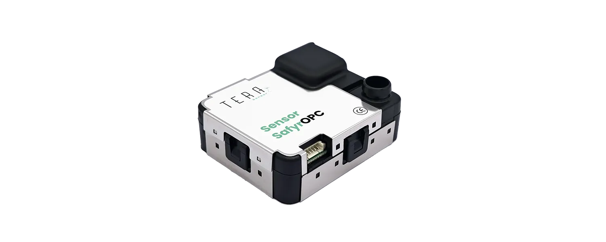

# Sensor SafyrOPC datasheet

<figure><figcaption></figcaption></figure>

<table><thead><tr><th width="273">Designation</th><th>Values</th><th>Unit</th></tr></thead><tbody><tr><td><strong>Technology</strong> </td><td>Optical</td><td></td></tr><tr><td><strong>Targeted pollutants</strong></td><td>Particulate Matter</td><td></td></tr><tr><td><strong>Outputs</strong></td><td></td><td></td></tr><tr><td></td><td>
Channel 1 : pcs >0.3 μm

Channel 2 : pcs >0.5 μm

Channel 3 : pcs >1.0 μm 

Channel 4 : pcs >2.5 μm 

Channel 5 : pcs >5.0 μm
</td><td>

pcs / m3

</td></tr><tr><td></td><td>Temperature Relative </td><td>°C</td></tr><tr><td></td><td>Humidity</td><td> %</td></tr><tr><td><strong>Airflow</strong></td><td>2.83</td><td>L/mn</td></tr><tr><td><strong>Size (l * w * h)</strong></td><td>detailed p.3</td><td>mm / Inches</td></tr><tr><td><strong>Lifetime (MTTF)</strong></td><td>10 000</td><td>hours</td></tr><tr><td><strong>Particle Size detection range</strong></td><td>0.3 - 10</td><td>μm diameter</td></tr><tr><td><strong>Concentration Range</strong><strong>1</strong></td><td>
0 to 3.3 . 10 9 

0 to 9.3 . 10
</td><td>
pcs / m3 

pcs / cfm
</td></tr><tr><td><strong>Lowest detectable concentration</strong></td><td>
350 

10
</td><td>
pcs / m3 

pcs / cfm
</td></tr><tr><td><strong>Detection efficiency @ 0.3 μm </strong><strong>2</strong></td><td>50 +/- 30</td><td>%</td></tr><tr><td><strong>Detection efficiency @ 0.5 μm </strong><strong>2</strong></td><td>100 +/- 20</td><td>μg/m3 (Arizona dust A1 equivalent)</td></tr><tr><td><strong>False Count</strong></td><td>&#x3C; 3 over 15 minutes</td><td>Raw particles number</td></tr><tr><td><strong>Repeatability error</strong><strong>3</strong></td><td></td><td></td></tr><tr><td>Channel 1 : pcs >0.3 μm
 Channel 2 : pcs >0.5 μm
 Channel 3 : pcs >1.0 μm
 Channel 4 : pcs >2.5 μm
 Channel 5 : pcs >5.0 μm</td><td>&#x3C; 3
 &#x3C; 3
 &#x3C; 5
 &#x3C; 10
 &#x3C; 15</td><td>%</td></tr><tr><td><strong>Accuracy</strong></td><td></td><td></td></tr><tr><td>Temperature
 Relative humidity</td><td>1
 5</td><td>°C
 %</td></tr><tr><td><strong>Refresh rate</strong></td><td>1 to 60</td><td>sec.</td></tr><tr><td><strong>Warm-up time</strong></td><td>10</td><td>sec.</td></tr><tr><td><strong>Power supply</strong></td><td>5</td><td>VDC</td></tr><tr><td><strong>Power consumption in operation</strong></td><td>&#x3C; 80</td><td>mA</td></tr><tr><td><strong>Power consumption in Sleep Mode</strong></td><td>&#x3C; 20</td><td>mA</td></tr><tr><td><strong>UART / Modbus (RS232 and</strong>
 <strong>RS485)</strong></td><td>RS485 Available with a converting electrical board only</td><td></td></tr><tr><td><strong>Operating conditions</strong></td><td></td><td></td></tr><tr><td>Temperature</td><td>-20 à +70
 253 to 343</td><td>°C
 K</td></tr><tr><td>Humidity</td><td>0 - 95 uncondensed</td><td>%</td></tr><tr><td>Pressure</td><td>500 to 1500</td><td>hPa</td></tr><tr><td><strong>Storage conditions</strong></td><td></td><td></td></tr><tr><td>Temperature</td><td>-20 à +70
 253 to 343</td><td>°C
 K</td></tr><tr><td>Humidity</td><td>0 - 95 uncondensed</td><td>%</td></tr><tr><td>Pressure</td><td>500 to 1500</td><td>hPa</td></tr><tr><td><strong>Certifications</strong></td><td>CE</td><td></td></tr><tr><td></td><td>RoHS compliant</td><td></td></tr><tr><td>Dimensions and weight</td><td>L 62 mm x l 52 mm x H 23 mm | 45 g
 L 2.4 / W 2.07 / H 0.9 inches | 1.59 Oz</td><td></td></tr></tbody></table>

1 Loss of linearity over this threshold
\
2 According to ISO 21 501-4 Standards
\
3 Calculated with the fifteen minutes moving average output

MECHANICAL SPECIFICATIONS

<figure><figcaption></figcaption></figure>

