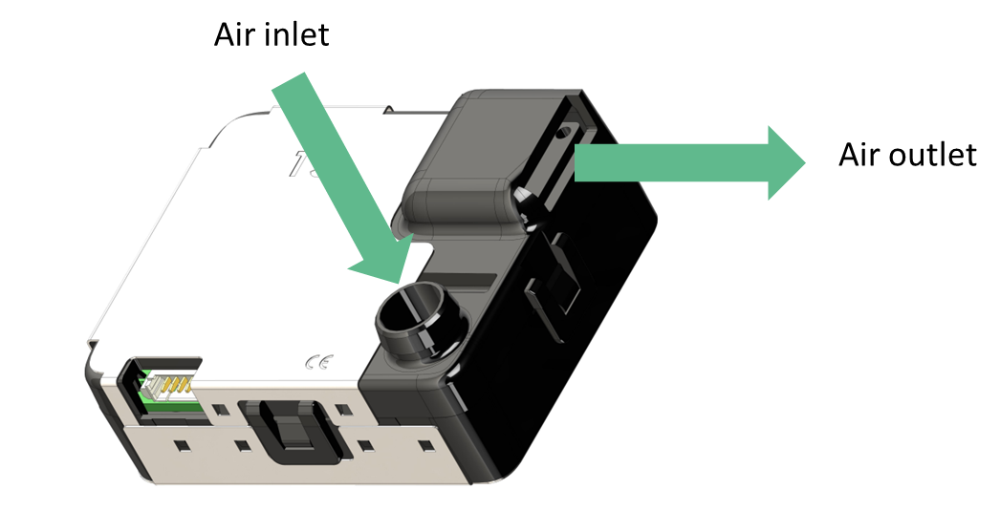
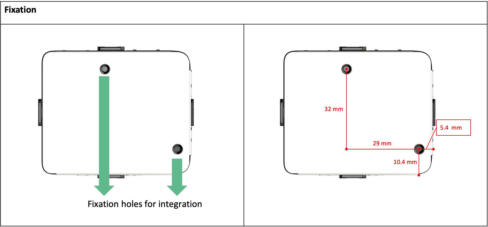
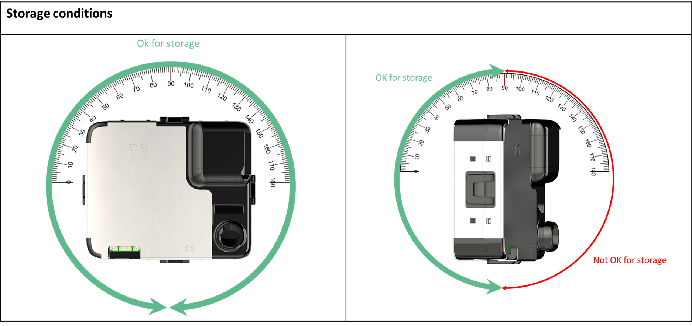
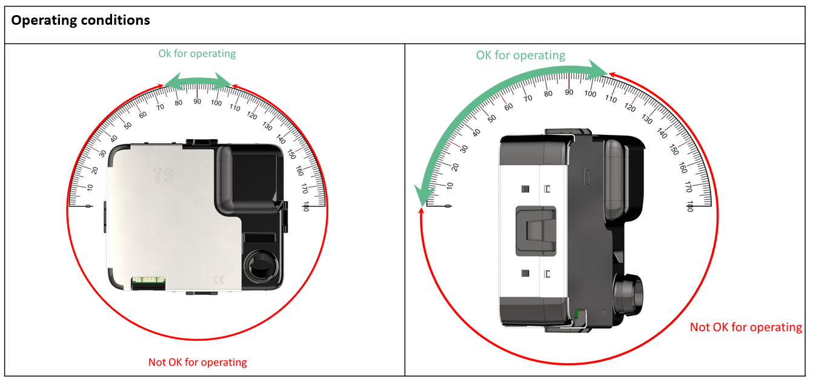
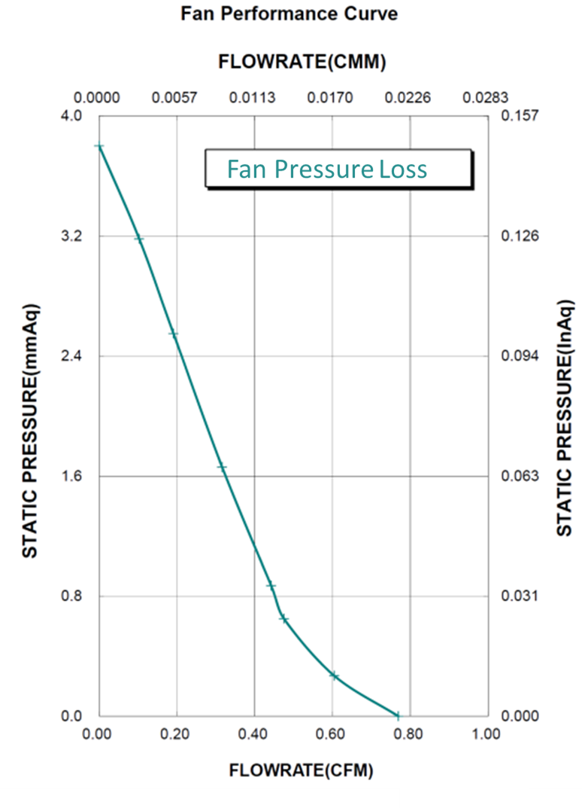

# Sensor SafyrOPC User Guide

## 1. About Sensor SafyrOPC <a href="#id-3xi6axjdh0m0" id="id-3xi6axjdh0m0"></a>

### 1.1 Generals <a href="#id-7cy7l5u4hwdz" id="id-7cy7l5u4hwdz"></a>

The Sensor SafyrOPC is an Optical Particle Counter (OPC) dedicated to particle measurement from 0.3 µm up to 10 µm in diameter in clean air environments.

The particles detected are classified in 5 different channels from:

* 0.3µm to 0.5µm
* 0.5µm to 1µm
* 1µm to 2.5µm
* 2.5µm to 5µm
* 5µm to 10µm

All those data are available within 3 different average periods (10sec, 1 min and 15 min) to best suit the dynamic of the external environment.

The outputs are expressed in number of particles per cubic meter (Pcs/m3) within 3 different average periods (10sec, 1 min and 15 min) to best suit the dynamic of the external environment.


* Sensor specifications, such as range, precision, conditions of use, etc.., are defined into the datasheet of the Sensor SafyrOPC sensor which can be found at [https://tera-sensor.com/](https://tera-sensor.com/)
* The user can find explanations about fluidic and mechanics to be helped for its Sensor SafyrOPC use/integration by referring to the Sensor SafyrOPC integration advice chapter.
* The user can find accessories either to quickly use and test the Sensor SafyrOPC but also to make an easier integration.


1. _Only available since 0x1123 firmware version_

### 1.2 Pinout and electrical considerations <a href="#bzyxeel0jse" id="bzyxeel0jse"></a>

<figure><figcaption></figcaption></figure>

| Pin # | Signal name |
| ----- | ----------- |
| 1     | GND         |
| 2     | DE/RE       |
| 3     | Rx (input)  |
| 4     | Tx (output) |
| 5     | +5V         |
| 6     | GND         |

* The Sensor SafyrOPC must be power supplied with + 5 VDC / 0.2V.
* The average current consumption is lower than 70mA. The average current consumption can be reduced to 20mA by turning the sensor into sleep mode.
* The Tx and Rx signal logical level is TTL (+3.3V) and the Rx signal is +5V tolerant.
* The signal DE/RE is useful only in case of RS485 half duplex mode use, to drive the external RS485 transceiver, otherwise, it could be left unconnected (high impedance).
* The ADAM TECH _125CH-B-06_ or MOLEX _51021-0600_ connector can be purchased to connect the Sensor SafyrOPC..\
  To connect the Sensor SafyrOPC to a PC, a FTDI cable such as _TTL-232R-3V3 (supplier: FTDI chip)_ can be used.\


<mark style="color:red;">Warning : do not connect the sensor directly on the RS232 port of a PC or to a RS485 network.</mark>

### 1.3 Sleep mode <a href="#m3k7sb5ydm2z" id="m3k7sb5ydm2z"></a>

To save the system energy by reducing the average Sensor SafyrOPC current consumption, the user can put the Sensor SafyrOPC sensor into sleep mode by sending the corresponding command (see [Writing commands list](https://docs.google.com/document/d/1mDMpD21G-W-E4irnLSpVwDwx0-xLc66_a1_b9S5H0ZM/edit#heading=h.c4r5wogk8vuz) and Writable registers list). This reduces the current consumption below 20mA.

In this mode, the Sensor SafyrOPC cannot provide any measurement as it has stopped the majority of its functionalities (fan, laser) but its communication remains functional.

As at the power on of the sensor, at the sleep mode exit, the measurements are reliable after 15 seconds.

To save more energy, if the user has the capability to, it is better to produce ON/OFF cycles by managing the sensor power supply . This way, the consumption will be 0mA during the Sensor SafyrOPC off phase and the average consumption will be considerably reduced.

### 1.4 Temperature and relative humidity measurement <a href="#id-8wiq6g4pmu6i" id="id-8wiq6g4pmu6i"></a>

The Sensor SafyrOPC measures its internal temperature and relative humidity for its own need and these values are accessible thanks to reading commands (see 0x14 command reply and Readable registers list).

However, these internal values are biased by internal heat of the sensor due to PCB power dissipation. So, the internal temperature and relative humidity are only technical data.

It will not take into account the global casing used by the integrator and adjustments may be needed to fit with outdoor parameters.

### 1.5 Status code description <a href="#id-1oqkk0z3d70x" id="id-1oqkk0z3d70x"></a>

The Sensor SafyrOPC makes continuous internal diagnosis in order to let the user know the state of the sensor and so, the validity of the measurements.

The state is coded on 2 bytes (1) and it contents flags corresponding to errors which can occur:\


| Bit 15 | Bit 14 | Bit 13 | Bit 12 | Bit 11 | Bit 10 | Bit 9 | Bit 8                      |
| ------ | ------ | ------ | ------ | ------ | ------ | ----- | -------------------------- |
| -      | -      | -      | -      | -      | -      | -     | <p>Default</p><p>State</p> |

| Bit 7       | Bit 6        | Bit 5     | Bit 4      | Bit 3 | Bit 2     | Bit 1          | Bit 0       |
| ----------- | ------------ | --------- | ---------- | ----- | --------- | -------------- | ----------- |
| Laser Error | Memory Error | Fan Error | T/RH Error | -     | Not Ready | Degraded State | Sleep State |

* bit 0: set if the user has sent a sleep mode command or if the sensor is in default state (bit 8).\
  In simple protocol, the only authorized command still possible is a Sensor SafyrOPC state read.\

* bit 1: set each time a minor error is detected and confirmed. The corresponding minor error flag is set. In this state, the Sensor SafyrOPC can still measure data but with less accuracy.\
  The minor errors are the following:
  * bit 4: T/RH Error: the sensor reading are out of specification
  * bit 5: Fan Error: the fan speed is out of range but the fan is still working
  * bit 6: Memory Error: the sensor can’t access its memory, some internal smart functions will not be available.
  * bit 7: Laser Error: the photodetector is not detecting any particle for at least 240 secs resulting from a possible laser error.\

* bit 2: set at power on, meaning that the sensor is starting and that measurements are not yet reliable until the bit is clear. It lasts 15 seconds.\
  This bit is also set after a wake-up of the sensor (sleep mode exit)\

* bit 8: set if the fan has stopped working, after 3 restart attempts, the sensor will switch to the default mode, set the default state flag meanwhile the degraded state flag is clear and the sensor goes into sleep mode.


_(1) The 8 most significant bits are only available using modbus protocol_


***


## 2. Sensor SafyrOPC communication <a href="#id-17dp8vu" id="id-17dp8vu"></a>

The Sensor SafyrOPC is able to either communicate using a simple protocol based only on proprietary UART frames or using Modbus standard protocol.

For both communication protocols, the physical layer is TTL 3.3V logical levels.

### 2.1 Serial communication configuration <a href="#id-6bmxpzzcqzjx" id="id-6bmxpzzcqzjx"></a>

The serial communication must be configured as followed :

* Default baud rate : 115 200
* Number of data bits: 8
* Parity : even
* Number of stop bits: 1

Notes:

* The Sensor SafyrOPC considers a timeout when there is 50ms of idle state between 2 bytes.
* The Sensor SafyrOPC delay is 50 ms (beginning of the reply to a request).

### 2.2 Simple protocol <a href="#lzhpfme2ur3" id="lzhpfme2ur3"></a>

The simple protocol uses the following frame format:

* Reading:
  * Request: address (0x81) + command function code + checksum
  * Response: address (0x81) + command function code + data + checksum\

* Writing:
  * Request: address (0x81) + command function code + data + checksum
  * Response: address (0x81) + command function code + checksum

\
The checksum is calculated in such a way that the sum of all the frame bytes is equal to a multiple of 256 (0x100): checksum = 0x100 – MOD ((sum of the other bytes), 256).

Example :

* 0x81 + 0x16 + 0x69 = 0x100

#### 2.2.1 Reading commands list <a href="#id-44sinio" id="id-44sinio"></a>

The Sensor SafyrOPC information’s reading can be realized through the following command frames:

| Cmd code | Description                                                                                   | Command                    |
| -------- | --------------------------------------------------------------------------------------------- | -------------------------- |
| 0x14     | Temperature and humidity readings                                                             | 0x81 0x14 0x6B             |
| 0x15     | Power on or sleep mode                                                                        | 0x81 0x15 0x6A (cf note 1) |
| 0x16     | Sensor state                                                                                  | 0x81 0x16 0x69             |
| 0x17     | Firmware version                                                                              | 0x81 0x17 0x68             |
| 0x22     | Modbus address                                                                                | 0x81 0x22 0x5D             |
| 0x31     | Concentrations (in number/m3) readings averaged over 10 seconds and updated every 1 second    | 0x81 0x31 0x4E             |
| 0x32     | Concentrations (in number/m3) readings averaged over 60 seconds and updated every 10 seconds  | 0x81 0x32 0x4D             |
| 0x33     | Concentrations (in number/m3) readings averaged over 900 seconds and updated every 60 seconds | 0x81 0x33 0x4C             |

#### 2.2.2 Reading replies <a href="#id-2jxsxqh" id="id-2jxsxqh"></a>

**2.2.2.1          0x31, 0x32, 0x33 replies**

| address | Cmd id | <p>State</p><p>(1 byte)</p> | <p>Particles >0.3µm</p><p>pcs/m3</p><p>(4 bytes)</p> | <p>Particles >0.5µm</p><p>pcs/m3</p><p>(4 bytes)</p> | <p>Particles >1µm pcs/m3</p><p>(4 bytes)</p> | <p>Particles >2.5µm pcs/m3</p><p>(4 bytes)</p> | <p>Particles >5µm</p><p>pcs/m3</p><p>(4 bytes)</p> | Checksum |
| ------- | ------ | --------------------------- | ---------------------------------------------------- | ---------------------------------------------------- | -------------------------------------------- | ---------------------------------------------- | -------------------------------------------------- | -------- |
| 0x81    | 0x31   | 0x00                        | 0x00A86CE9                                           | 0x000BE42D                                           | 0x00026B9C                                   | 0x00000000                                     | 0x00000000                                         | 0x2C     |
| 0x81    | 0x32   | 0x00                        | 0x0370F1EF                                           | 0x0007BAEF                                           | 0x0002349B                                   | 0x00003044                                     | 0x00003044                                         | 0x91     |
| 0x81    | 0x33   | 0x00                        | 0x02DCAE93                                           | 0x00091866                                           | 0x0001DC4D                                   | 0x00005071                                     | 0x00005071                                         | 0xFA     |

\
The particulate matter concentrations in pcs/m3 are coded with 4 bytes (32 bits).

For example :

The response 0x81 0x32 0x00 0x00 0xA8 0x6C 0xE9 0x00 0x0B 0xE4 0x2D 0x00 0x02 0x6B 0x9C 0x00 0x00 0x00 0x00 0x00 0x00 0x00 0x00 0x2C

Signifies that the results are averaged over 1 minute. No error occurred during the measurement and the state code is 0.

In this example, the measured concentrations are:

| Description                       | Data (4 bytes) | Factor | Results    |
| --------------------------------- | -------------- | ------ | ---------- |
| Particles >0.3µm pcs/m3 (4 bytes) | 0x00A86CE9     | 1      | 11 037 929 |
| Particles >0.5µm pcs/m3 (4 bytes) | 0x000BE42D     | 1      | 779 309    |
| Particles >1µm pcs/m3 (4 bytes)   | 0x00026B9C     | 1      | 158 620    |
| Particles >2.5µm pcs/m3 (4 bytes) | 0x00000000     | 1      | 0          |
| Particles >5µm pcs/m3 (4 bytes)   | 0x00000000     | 1      | 0          |

**2.2.2.2          0x16 command reply (state)**

| Address | Cmd code | State (1 byte) | Checksum |
| ------- | -------- | -------------- | -------- |
| 0x81    | 0x16     | 0x04           | 0x65     |

\
The 0x16 command frame requests the State code. This reply is also the default response to other requests when the Sensor SafyrOPC has no data to send neither because the sensor has just been switched on nor because the sensor is in the Default State and/or Sleep State. See Status code description for State code decoding.

**2.2.2.3          0x17 command reply**

| Address | Cmd code | State | Firmware version | Checksum |
| ------- | -------- | ----- | ---------------- | -------- |
| 0x81    | 0x17     | 0x00  | 0x1124           | 0x33     |

\
The Sensor SafyrOPC replies to its firmware version. If the Sensor SafyrOPC is in the SLEEP mode, it will only reply to its state code.

#### 2.2.3 Writing command list <a href="#hx14gxiea98f" id="hx14gxiea98f"></a>

| Cmd code | Description                 | full command        |
| -------- | --------------------------- | ------------------- |
| 0x15     | Sleep mode entry / exit (1) | 0x81 0x15 0x6A      |
| 0x22     | Modbus address write (2)    | 0x81 0x22 0x03 0x5A |

(1) At each 0x15 command frame sent, the Sensor SafyrOPC changes its functional state alternately. To know its state (see Status code description) before sending the command frame, the user can send a 0x16 command frame

(2) The 0x22 command is used to write the new modbus address. The third byte (here 0x03) is the address, which must be different from 0. See 0x22 command reply.\


#### 2.2.4 Writing replies <a href="#hsvrmoaf0nin" id="hsvrmoaf0nin"></a>

**2.2.4.1          0x15 command reply (sleep mode)**

| address | Command code | State (1 byte) | Checksum |
| ------- | ------------ | -------------- | -------- |
| 0x81    | 0x15         | 0x01           | 0x69     |

When the sensor receives a sleep mode command frame, it turns into sleep mode, stops its functionalities (fan, laser and so, the measurements) and replies with a state code whose the sleep flag is set

During the sleep mode, if the sensor receives a new 0x15 command frame, the Sensor SafyrOPC switches on and sends the first data after 15 seconds.

While the sensor is in sleep mode, it replies to all the other command frames by sending a 0x16 command code and the state code.

If the Sensor SafyrOPC is in the Default State and so in sleep mode, the 0x15 command frame turns on the sensor: it allows the user to try a restart without errors.


**2.2.4.2          0x22 command reply**

| address | Command code | State (1 byte) | Modbus address | Checksum |
| ------- | ------------ | -------------- | -------------- | -------- |
| 0x81    | 0x22         | 0x00           | 0x03           | 0x5A     |

The user can change the modbus device address using this command. The sensor replies to its new modbus address. The addresses start at 1 up to 15 (decimal values)


#### 2.2.5 Error codes <a href="#id-4d9oydrk93hf" id="id-4d9oydrk93hf"></a>

The Sensor SafyrOPC sensor replies the state code (see 0x16 command reply (state)) in these different cases:

* sleep mode
* default mode
* measurements not ready (in case of power on or sleep mode exit)

It won’t send back any response in case of:

* wrong checksum
* wrong command code
* wrong address
* command frame length too long (>5 bytes)


### 2.3 Modbus Protocol <a href="#id-2bn6wsx" id="id-2bn6wsx"></a>

The second way to get data from the Sensor SafyrOPC sensor is using the modbus protocol, respecting the modbus standard (v1.1b modbus specification compliance).\


#### 2.3.1 General information <a href="#fni7gn4wn53c" id="fni7gn4wn53c"></a>

#### **2.3.1.1**          Bytes order <a href="#o0y26dilqa3v" id="o0y26dilqa3v"></a>

All registers are coded on 2 bytes (word) but some data can be coded on 2 or more registers.

If a data is coded on 4 bytes (2 words, so 2 registers), such as Particles measurements, the second word is the most significant one.

Example: 0x01 0x03 0x04 0xB5 0x7F 0x02 0x71 0x2C 0xA3, is the reply of particles>0.3µm on 10 sec average measurement value request. The raw value is: (0xB57F) + (0x0271)\*65536 = 41 006 463 pcs/m3.

#### **2.3.1.2**          Modbus default address <a href="#bn72zd1careh" id="bn72zd1careh"></a>

The default modbus address is 0x01 but it can be changed by sending a simple protocol write command frame or modbus command write frame. The change is saved into its memory and is kept even after a restart.\


#### **2.3.1.3**          Timings <a href="#bvybl8ehgdqa" id="bvybl8ehgdqa"></a>

Timings are the ones specified in Serial communication configuration:

* The Sensor SafyrOPC considers a timeout when there is 50ms of idle state between 2 bytes.
* The Sensor SafyrOPC delay is 50 ms (beginning of the reply to a request).\


#### **2.3.1.4**          Function codes <a href="#id-6whfxgq676pt" id="id-6whfxgq676pt"></a>

Sensor SafyrOPC registers are accessible through 3 function codes:

* 0x03: read multiple holding registers
* 0x10: write multiple registers
* 0x17: Read/Write Multiple registers


### 2.3.2 Readable registers list <a href="#id-2p2csry" id="id-2p2csry"></a>

_The following registers are only readable and accessible with a read or read/write multiple holding registers function command (0x03 or 0x17)_

| Register            | Name                                      | Description                                                                  |
| ------------------- | ----------------------------------------- | ---------------------------------------------------------------------------- |
| 1 (0x01)            | Firmware version                          | Embedded firmware version                                                    |
| 19 (0x13)           | Status                                    | Sensor SafyrOPC status (error codes)                                         |
| 20-21 (0x14-0x15)   | GetTenSecondesAverageResult.Nbsup\_0\_3   | average over 10s of the number of particles / m3 of size > 0.3 μm            |
| 22-23 (0x16-0x17)   | GetTenSecondesAverageResult.Nbsup\_0\_5   | average over 10s of the number of particles / m3 of size > 0.5 μm            |
| 24-25 (0x18-0x19)   | GetTenSecondesAverageResult.Nbsup\_1\_0   | average over 10s of the number of particles / m3 of size > 1.0 μm            |
| 26-27 (0x1A-0x1B)   | GetTenSecondesAverageResult.Nbsup\_2\_5   | average over 10s of the number of particles / m3 of size > 2.5µm             |
| 28-29 (0x1C0x1D)    | GetTenSecondesAverageResult.Nbsup\_5\_0   | average over 10s of the number of particles / m3 of size > 5.0µm             |
| 30-31 (0x1E-0x1F)   | GetOneMinuteAverageResult.Nbsup\_0\_3     | average over 60s of the number of particles / m3 of size > 0.3µm             |
| 32-33 (0x20-0x21)   | GetOneMinuteAverageResult.Nbsup\_0\_5     | average over 60s of the number of particles / m3 of size > 0.5µm             |
| 34-35 (0x22-0x23)   | GetOneMinuteAverageResult.Nbsup\_1\_0     | average over 60s of the number of particles / m3 of size > 1.0µm             |
| 36-37 (0x24-0x25)   | GetOneMinuteAverageResult.Nbsup\_2\_5     | average over 60s of the number of particles / m3 of size > 2.5µm             |
| 38-39 (0x26-0x27)   | GetOneMinuteAverageResult.Nbsup\_5\_0     | average over 60s of the number of particles / m3 of size > 5.0µm             |
| 40-41 (0x28-0x29)   | GetFifteenMinuteAverageResult.Nbsup\_0\_3 | average over 15 min of the number of particles / m3 of size > 0.3µm          |
| 42-43 (0x2A-0x2B)   | GetFifteenMinuteAverageResult.Nbsup\_0\_5 | average over 15 min of the number of particles / m3 of size > 0.5µm          |
| 44-45 (0x2C-0x2D)   | GetFifteenMinuteAverageResult.Nbsup\_1\_0 | average over 15 min of the number of particles / m3 of size > 1.0µm          |
| 46-47 (0x2E-0x2F)   | GetFifteenMinuteAverageResult.Nbsup\_2\_5 | average over 15 min of the number of particles / m3 of size > 2.5µm          |
| 48-49 (0x30-0x31)   | GetFifteenMinuteAverageResult.Nbsup\_5\_0 | average over 15 min of the number of particles / m3 of size > 5.0µm          |
| 106 (0x6A)          | Humidity                                  | Humidity in % multiplied by 100                                              |
| 107 (0x6B)          | Temperature                               | Temperature in °C multiplied by 100                                          |
| 113-114 (0x71-0x72) | 0.3-0.5 raw cumulative (2)                | Raw cumulative number of detection by the sensor in the channel 0.3 - 0.5 µm |
| 115-116 (0x73-0x74) | 0.3-0.5 raw cumulative (2)                | Raw cumulative number of detection by the sensor in the channel 0.5 - 1 µm   |
| 117-118 (0x75-0x76) | 0.3-0.5 raw cumulative (2)                | Raw cumulative number of detection by the sensor in the channel 1 - 2.5 µm   |
| 119-120 (0x77-0x78) | 0.3-0.5 raw cumulative (2)                | Raw cumulative number of detection by the sensor in the channel 2.5 - 5 µm   |
| 121-122 (0x79-0x7A) | 0.3-0.5 raw cumulative (2)                | Raw cumulative number of detection by the sensor in the channel 5 - 10 µm    |

1. See example below explaining how to decode mass and quantity concentration.
2. _Value increases every second, value restarted at every restart of the sensor._


**Measurement decoding example :**

* Particles concentrations request command on 1 minute average is:&#x20;

```
01 03 00 1E 00 0A A5 CB
```

* Sensor’s reply&#x20;

```
01 03 14 92 71 01 DF EC 16 00 25 3B 18 00 0D F4 23 00 00 21 AC 00 00 A5 2C
```

* Calculation of the particles number concentration / liter whose size is > 0.3μm :
  * 0x9271 is the less significant word and 0x01DF is the most significant word
  * the concatenate value (raw value) is 0x01DF9271 which is 31 429 233 in decimal. This is the measured physical value in Nb/m3, averaged over 1 minute of all particles detected with a size above 0.3µm.
* Calculation of the particles number concentration / liter whose size is > 0.5μm :
  * 0xEC16 is the less significant word and 0x0025 is the most significant word
  * the concatenate value (raw value) is 0x0025EC16 which is 2 485 470 in decimal. This is the measured physical value in Nb/m3, averaged over 1 minute of all particles detected with a size above 0.3µm.
* Calculation of the number of particles on the channel 0.3 - 0.5 µm:
  * To do so, you need to subtract the registers >0.3µm - registers >0.5µm
  * So the final number of particles here would be:

channel 0.3 - 0.5µm = 31 429 233 - 2 485 470 = 28 943 763 particles/m3


### 2.3.3 Writable registers list <a href="#izkgalhf2a0a" id="izkgalhf2a0a"></a>

_The following registers are writable and accessible with a write or read/write multiple holding registers function command (0x10 or 0x17). These are advanced registers that need to be considered carefully before changed, as they may modify the sensor behaviour. We recommend contacting Tera Sensor before modifying them._

| Register   | Name                 | Description                                                           |
| ---------- | -------------------- | --------------------------------------------------------------------- |
| 88 (0x58)  | Modbus address       | <p>Sensor SafyrOPC with Modbus protocol</p><p>( range is 1 to 15)</p> |
| 100 (0x64) | Fan target ratio (%) | <p>Fan rotation setpoint (%)</p><p>(to be divided by 100) (1)</p>     |

1. _As it will change the behavior of the sensor and the reliability of the measurements, Tera Sensor does not recommend any change ._
2. _The baud rate of the simple and modbus communication can be changed by writing the identifier code corresponding to the desired baud rate value (see table below)._


### 2.3.4 Error codes <a href="#bcuk0ktjkrdg" id="bcuk0ktjkrdg"></a>

The Sensor SafyrOPC is able to make specific reply depending on the Modbus frame received:

* **Error code**, with specific error code depending on the Modbus frame received:
  * Inexistant code function (CF)
    * reply: ModbusAdress 0x80|CF 0x01 CRC1 CRC2
  * Inexistant registers (write)
    * reply: ModbusAdress 0x80|CF 0x02 CRC1 CRC2\
      note: only true for 0x10 code function. For the 0x17 code function, the Sensor SafyrOPC sends back correctly the data read, without any error code.\

* **No reply**, in case of:
  * wrong checksum
  * wrong Modbus address\

* **Standard reply**, even if the frame received is partially correct:
  * Registers quantity exceeding the maximum allowed:
    * 125 registers to be read in a single time
    * 18 registers to be written in a single time

In those cases, the Sensor SafyrOPC will set the quantity requested equal to the maximum.


* Inexistent registers (to be read)
  * data corresponding to the nonexistent register will be 0x00 0x00
* Frame content inconsistency (number of bytes not as expected depending on the code function):
  * If there are more bytes than expected, the Sensor SafyrOPC truncates the frame to match the size with the one expected according to the code function. It will then interpret the truncated frames and the reply could not be consistent with the user request.
  * If there are less bytes than expected, the Sensor SafyrOPC interprets the frames and the reply could not be consistent with the user request.


***


## 3. RS485 <a href="#q0rtli9n4t" id="q0rtli9n4t"></a>

If the user wants to integrate the Sensor SafyrOPC on an RS485 half duplex bus, despite the Sensor SafyrOPC does not have an embedded RS485 transceiver, it has the ability to drive an external one thanks to its DE/RE output signal which indicates to the RS485 transceiver if it should be in receive or in transmission mode.

Even if any module of that kind could work also well, Tera Sensor is used to work with the PModRS485 (from digilent supplier) or the DSD TECH SH-U12. Both converters have been tested and work properly for that purpose.


***


## 4. Test software <a href="#id-3o7alnk" id="id-3o7alnk"></a>

Tera Sensor provides software that can help the user to communicate with the sensor and test it before working on the integration.


Note: The computer running the software should have Windows 10 or newer version.


***


## 5. Sensor SafyrOPC Mechanical tips <a href="#id-30j0zll" id="id-30j0zll"></a>

### 5.1 Introduction <a href="#fsn6tbu3njt" id="fsn6tbu3njt"></a>

This document has been written in order to support our customer to optimize the integration of the Sensor SafyrOPC in their device and obtain the best and most accurate results for particle monitoring. The mechanical settings and the guidelines for integration of the Sensor SafyrOPC will be approached in the following part of the document to guarantee the best performance for the sensor. This guideline is a tips summary of more than 20 years experience in the air quality monitoring domain.


### 5.2 Mechanical settings <a href="#fagq4qjrlgvf" id="fagq4qjrlgvf"></a>

#### 5.2.1 Air path in the sensor <a href="#bzj201ozsosd" id="bzj201ozsosd"></a>

The Sensor SafyrOPC presents a 6 pins Molex connector to ensure power supply and to communicate with the sensor. Once the power supply is provided to the sensor, the sensor turns on automatically, the fan starts and the airflow path operates. The air inlet is facing the front of the sensor, while the outlet is rejecting the air by the side of the sensor to limit particle recycling effects.

<figure><figcaption></figcaption></figure>

#### 5.2.2 Fixation <a href="#ro6uq31tq7ro" id="ro6uq31tq7ro"></a>

You can fix the Sensor SafyrOPC thanks to the two holes in the back of the sensor. The holes are made to receive tap screws M2.5 and are 5 mm deep.

<figure><figcaption></figcaption></figure>

## 6. General Sensor SafyrOPC integration <a href="#uzrtm2taked3" id="uzrtm2taked3"></a>

### 6.1 Positions for storage <a href="#id-97hn9qxje0t" id="id-97hn9qxje0t"></a>



### 6.2 Positions to operate <a href="#b6q29gdmqsmy" id="b6q29gdmqsmy"></a>



Why this recommendations for operating conditions:

* The Sensor SafyrOPC inlet is an aerolic filter that stops particles larger than 10µm from entering the sensor. If the sensor is upside down, then the aerolic filter will not be able to block those big particles and the lifetime of the sensor will be affected due to clogging.
* The fan is a critical part if not correctly set in the sensor. Inside the fan, a small amount of oil allows the rotation without friction. If the Sensor SafyrOPC (and consequently the fan) is not correctly placed, the oil can leak and it results with stretching in the fan, an increased power consumption to compensate for the frictions, until the failure of the fan. That will strongly affect the lifetime of the sensor.

### 6.3 Pressure lost and Deported Inlet <a href="#qnty29jijs5e" id="qnty29jijs5e"></a>

6.3.1 Pressure Loss

The sensor uses an active airflow to sample the particles. In order to keep his accuracy, we advise you to put the inlet directly to the air you want to monitor. Be aware that the fan allowing the flow inside the sensor is sensitive to pressure loss, it does not allow a differential pressure between the inlet and outlet more than 0.3 mbar. As the fluidic path already generates a 0.15 mbar pressure loss, the remaining possible pressure loss is 0.15 mbar due to additional features, for instance a deported inlet of the Sensor SafyrOPC.




***


## 7. Electrical integrity <a href="#a87ppbkc2s87" id="a87ppbkc2s87"></a>

As the EMC shield of the sensor is connected to its ground, the integrator should avoid a mechanical contact to the system earth / ground, by using a non conductive material or an electrical insulation.

This will avoid any unwanted current path flow in case of power supply isolation fault, which would damage the sensor.


***


## 8. Accessories <a href="#x6kbk82ynqfz" id="x6kbk82ynqfz"></a>

Tera Sensor sells additional components to help the user/integrator:

* anti-static tube for remote short distance measuring (easier integration)
* plug and play: USB (FTDI) communication cable (plug and play for a quick use)\
  Note: it also power supplies the Sensor SafyrOPC through the USB power lines but special care must be taken regarding the current drawn from the USB port.
* Demo software to get data without getting into the code writing process (quick use)

Please visit [https://tera-sensor.com/fr/](https://tera-sensor.com/fr/) to find more information and to contact the sales service.


***


## Revision history <a href="#i2an4ebw5mzx" id="i2an4ebw5mzx"></a>

| Date       | Revision | Changes                                                                                                                                                         |
| ---------- | -------- | --------------------------------------------------------------------------------------------------------------------------------------------------------------- |
| 2018/05/12 | 1.2      | <p>- Add warnings at serial port communication chapter</p><p>- Add modbus protocol</p>                                                                          |
| 2024/11/19 | 1.4      | <p>- Add summary</p><p>- Remove GetTimeOn modbus reading command</p><p>- Full graphic renewal of the Userguide</p><p>- Mechanical tips for integrator added</p> |
